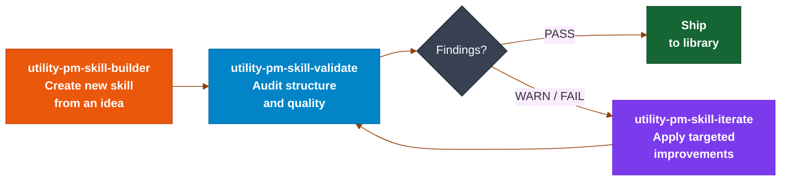
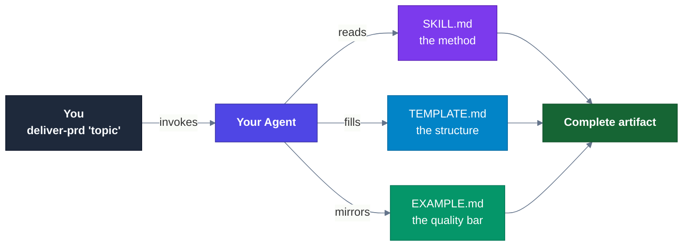
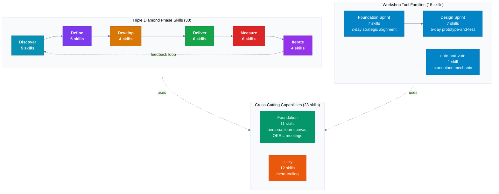
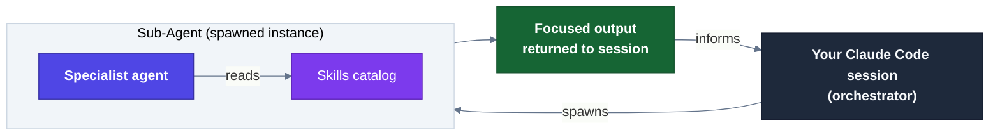

<a id="pmskills"></a>

# Product Manager Skills

 [](LICENSE) [](CONTRIBUTING.md) [](https://github.com/deanpeters/Product-Manager-Skills/releases/latest) [](https://code.claude.com/docs/en/plugin-marketplaces) 

```text
╔════════════════════════════════════════════════════════════════════╗
║                                                                    ║
║   ██████╗ ███╗   ███╗    ███████╗██╗  ██╗██╗██╗     ██╗     ███████╗
║   ██╔══██╗████╗ ████║    ██╔════╝██║ ██╔╝██║██║     ██║     ██╔════╝
║   ██████╔╝██╔████╔██║    ███████╗█████╔╝ ██║██║     ██║     ███████╗
║   ██╔═══╝ ██║╚██╔╝██║    ╚════██║██╔═██╗ ██║██║     ██║     ╚════██║
║   ██║     ██║ ╚═╝ ██║    ███████║██║  ██╗██║███████╗███████╗███████║
║   ╚═╝     ╚═╝     ╚═╝    ╚══════╝╚═╝  ╚═╝╚═╝╚══════╝╚══════╝╚══════╝
║                                                                    ║
║   77 battle-tested skills + 6 command workflows                    ║
║   Claude Code • Cursor • Codex  • n8n • OpenClaw • and more ...    ║
║                                                                    ║
║   v0.84 • August 10, 2026 • CC BY-NC-SA 4.0                        ║
╚════════════════════════════════════════════════════════════════════╝
```

**77 battle-tested PM frameworks, ready for Claude, Codex, ChatGPT, and any agent that can read structured knowledge.**

---

## Why This Exists

Generic AI output is a PM's worst enemy. When you tell your agent "write a PRD" without shared context, you get a generic document that no stakeholder trusts and no engineer can act on.

This library gives both you and your AI agent the same professional foundation: the *why* behind each framework, the failure modes to avoid, and the judgment to apply them correctly. You stop repeating yourself. Your agent stops guessing. The work gets better.

**The goal is dual — functional and pedagogic in equal measure.** Skills equip agents to do PM work at a professional level, and they teach the human PM the reasoning behind each framework — so you can explain it, adapt it, and pass it on. Neither is a byproduct of the other.

---

## What You Can Get Done

Navigate by what you're actually trying to accomplish:

**Framing and strategy**
- [problem-framing-canvas](skills/problem-framing-canvas/SKILL.md) — MITRE's Look Inward / Look Outward / Reframe sequence; stops teams from solving the wrong problem
- [positioning-statement](skills/positioning-statement/SKILL.md) — Geoffrey Moore's template for defining who you serve, what you solve, and how you're different
- [product-strategy-session](skills/product-strategy-session/SKILL.md) — full strategy arc: positioning → problem framing → solution exploration → roadmap (2-4 weeks)

**Stakeholder alignment**
- [stakeholder-identification](skills/stakeholder-identification/SKILL.md) — map every stakeholder before engaging anyone: broad brainstorm → allies/audiences/influencers → R/P/D marking → equity lens → narrow to priority targets
- [stakeholder-mapping](skills/stakeholder-mapping/SKILL.md) — run two complementary grids (Power × Interest for engagement strategy; Impact × Power for whose voice to elevate) and compare to find the gaps
- [stakeholder-engagement-advisor](skills/stakeholder-engagement-advisor/SKILL.md) — per-stakeholder engagement planning: diagnoses their profile and context, then delivers tailored message framing, medium, cadence, and a named next action

**Customer discovery and research**
- [discovery-interview-prep](skills/discovery-interview-prep/SKILL.md) — plans Mom Test-style interviews based on your research goals
- [opportunity-solution-tree](skills/opportunity-solution-tree/SKILL.md) — generates opportunities and solutions, then recommends the best proof-of-concept to test first
- [discovery-process](skills/discovery-process/SKILL.md) — complete discovery cycle: frame → research → synthesize → validate (3-4 weeks)

**Prioritization and roadmapping**
- [prioritization-advisor](skills/prioritization-advisor/SKILL.md) — asks 3-5 questions about your context, then recommends RICE, ICE, Kano, or the right alternative
- [epic-breakdown-advisor](skills/epic-breakdown-advisor/SKILL.md) — splits large epics using Richard Lawrence's 9 patterns
- [roadmap-planning](skills/roadmap-planning/SKILL.md) — gather inputs → define epics → prioritize → sequence → communicate (1-2 weeks)

**Writing PM deliverables**
- [user-story](skills/user-story/SKILL.md) — Mike Cohn format + Gherkin acceptance criteria, with anti-patterns
- [prd-development](skills/prd-development/SKILL.md) — structured PRD: problem → personas → solution → metrics → stories (2-4 days)
- [press-release](skills/press-release/SKILL.md) — Amazon Working Backwards: clarify product vision before writing a line of spec

**Validation and experimentation**
- [pol-probe-advisor](skills/pol-probe-advisor/SKILL.md) — recommends which prototype type to run based on your hypothesis and risk level
- [pol-probe](skills/pol-probe/SKILL.md) — template for documenting lightweight validation experiments before building

**Finance and growth**
- [business-health-diagnostic](skills/business-health-diagnostic/SKILL.md) — diagnoses SaaS health across growth, retention, efficiency, and capital using your real metrics
- [organic-growth-advisor](skills/organic-growth-advisor/SKILL.md) — McKinsey Growth Pyramid triage: diagnoses whether your constraint is in new segments, geographies, channels, or products
- [feature-investment-advisor](skills/feature-investment-advisor/SKILL.md) — build / don't build recommendation using revenue impact, cost, ROI, and strategic value

**Market and competitive intelligence**
- [intel-discipline-advisor](skills/intel-discipline-advisor/SKILL.md) — start here: triages the question on your desk into the right intelligence disciplines, cadence, and executing skill
- [competitive-analysis-process](skills/competitive-analysis-process/SKILL.md) — the six-step umbrella: landscape → product comparison → customer needs → business baseline → positioning → strategic direction
- The investigation chain: [market-landscape-scan](skills/market-landscape-scan/SKILL.md) → [competitive-research-snapshot](skills/competitive-research-snapshot/SKILL.md) → [competitive-intel-watch](skills/competitive-intel-watch/SKILL.md) → [battle-card-builder](skills/battle-card-builder/SKILL.md) — each consumes the prior's schema, so research becomes a cadence instead of a one-off deck
- [tam-sam-som-calculator](skills/tam-sam-som-calculator/SKILL.md) — market sizing three ways: your own numbers, guided interview, or autonomous bottom-up research a skeptical CFO can attack one assumption at a time

**Aging products: extend, replace, or retire**
- [lifecycle-play-advisor](skills/lifecycle-play-advisor/SKILL.md) — start here when a product stops growing: seven transition questions establish the stage, then it picks the play — extend, replace, or retire — and tells you when the honest answer is "nothing yet"
- [product-lifecycle-plays](skills/product-lifecycle-plays/SKILL.md) — the framework behind that call: the PLC strategy grid, the seven replacement hazards, and a risk register whose last column asks *what is Plan B?*
- [eol-process](skills/eol-process/SKILL.md) — the whole sunset in six phases, decide → align → plan → prepare → announce → close, including the post-EOL review everyone skips
- The EOL chain: [eol-readiness-advisor](skills/eol-readiness-advisor/SKILL.md) → [eol-stakeholder-sequence](skills/eol-stakeholder-sequence/SKILL.md) → [eol-checklist](skills/eol-checklist/SKILL.md) → [eol-internal-enablement](skills/eol-internal-enablement/SKILL.md) → [eol-message](skills/eol-message/SKILL.md) — every one runs standalone, sized Light/Standard/Heavy by you

**Career and leadership transitions**
- [director-readiness-advisor](skills/director-readiness-advisor/SKILL.md) — coaches PMs through the PM→Director shift across four situations: preparing, interviewing, newly landed, recalibrating
- [vp-cpo-readiness-advisor](skills/vp-cpo-readiness-advisor/SKILL.md) — coaches Directors through VP/CPO transition, including a CEO interview framework for evaluating roles before you accept
- [executive-onboarding-playbook](skills/executive-onboarding-playbook/SKILL.md) — 30-60-90 day diagnostic playbook for VP/CPO transitions

**AI product work**
- [ai-shaped-readiness-advisor](skills/ai-shaped-readiness-advisor/SKILL.md) — assesses whether you're automating tasks (AI-first) or redesigning how you work (AI-shaped), then tells you which competency to build first
- [context-engineering-advisor](skills/context-engineering-advisor/SKILL.md) — diagnoses context stuffing vs. context engineering and guides memory architecture for AI-powered products
- [agent-orchestration-advisor](skills/agent-orchestration-advisor/SKILL.md) — guides multi-agent workflow design across four dimensions

---

## Get Started

Choose your setup:

| I use... | Get this | Notes |
|---|---|---|
| Claude Desktop or Claude Web | [`pm-skills-starter-pack.zip`](https://github.com/deanpeters/Product-Manager-Skills/releases/latest/download/pm-skills-starter-pack.zip) | Unzip, then upload the individual skill ZIPs to Claude Skills |
| Claude Code | Plugin marketplace | `claude /plugin marketplace add deanpeters/Product-Manager-Skills` |
| Codex | [`pm-skills-codex.zip`](https://github.com/deanpeters/Product-Manager-Skills/releases/latest/download/pm-skills-codex.zip) | Installs `.agents/skills` and `AGENTS.md` |
| Not sure | [`pm-skills-starter-pack.zip`](https://github.com/deanpeters/Product-Manager-Skills/releases/latest/download/pm-skills-starter-pack.zip) | Start here |

**All downloads:** [GitHub Releases](https://github.com/deanpeters/Product-Manager-Skills/releases/latest)

### Themed packs for Claude Desktop / Web

Each pack below is a ZIP of upload-ready skill ZIPs — unzip, then upload individuals to Claude Skills:

| Pack | Download | What's inside |
|---|---|---|
| Starter | [`pm-skills-starter-pack.zip`](https://github.com/deanpeters/Product-Manager-Skills/releases/latest/download/pm-skills-starter-pack.zip) | Core skills across all categories |
| Discovery | [`02-discovery-pack.zip`](https://github.com/deanpeters/Product-Manager-Skills/releases/latest/download/02-discovery-pack.zip) | Research, interviewing, synthesis |
| Strategy | [`03-strategy-pack.zip`](https://github.com/deanpeters/Product-Manager-Skills/releases/latest/download/03-strategy-pack.zip) | Positioning, roadmapping, prioritization |
| Delivery | [`04-delivery-pack.zip`](https://github.com/deanpeters/Product-Manager-Skills/releases/latest/download/04-delivery-pack.zip) | PRDs, stories, epics |
| AI PM | [`05-ai-pm-pack.zip`](https://github.com/deanpeters/Product-Manager-Skills/releases/latest/download/05-ai-pm-pack.zip) | Context engineering, orchestration, readiness |
| Market Intel | [`06-market-intel-pack.zip`](https://github.com/deanpeters/Product-Manager-Skills/releases/latest/download/06-market-intel-pack.zip) | The full Market Intelligence Suite: disciplines, investigation chain, frameworks, monitors |
| Lifecycle & EOL | [`07-lifecycle-eol-pack.zip`](https://github.com/deanpeters/Product-Manager-Skills/releases/latest/download/07-lifecycle-eol-pack.zip) | Aging products: extend, replace, or retire — plus the full sunset process |
| All skills | [`99-all-skills-pack.zip`](https://github.com/deanpeters/Product-Manager-Skills/releases/latest/download/99-all-skills-pack.zip) | All 77 skills |

### Install guides

- [Claude Desktop / Web](docs/INSTALL-CLAUDE-DESKTOP.md)
- [Claude Code](docs/INSTALL-CLAUDE-CODE.md)
- [Codex](docs/INSTALL-CODEX.md)
- [Platform chooser for non-technical PMs](docs/PM%20Skills%20Rule-of-Thumb%20Guide.md)

---

## Try It First — Streamlit (beta)

Not ready to wire skills into your agent setup? Run the local playground first and kick the tires in your browser.

```bash
pip install -r app/requirements.txt
streamlit run app/main.py
```

What you can do:
- **Learn** — browse setup and integration paths without leaving the app
- **Find My Skill** — describe your situation in plain English and get recommended skills
- **Run Skills** — run a skill with your own scenario once you know what you want

Multi-provider support: Anthropic, OpenAI, Ollama. API keys via environment variables only (no in-app key entry).

Docs: [`app/STREAMLIT_INTERFACE.md`](app/STREAMLIT_INTERFACE.md) · [`app/.env.example`](app/.env.example)

Feedback welcome via [GitHub Issues](https://github.com/deanpeters/Product-Manager-Skills/issues) or [LinkedIn](https://linkedin.com/in/deanpeters).

---

## 70 Skills, 3 Types

Skills are organized in three tiers that build on each other:

```
┌────────────────────────────────────────────────────────┐
│  WORKFLOW SKILLS (19)                                  │
│  Complete end-to-end PM processes (days to weeks)      │
│  Example: run a full discovery cycle or write a PRD    │
└────────────────────────────────────────────────────────┘
                       ↓ orchestrates
┌────────────────────────────────────────────────────────┐
│  INTERACTIVE SKILLS (27)                               │
│  Guided discovery — 3-5 questions, then recommendations│
│  Example: "Which prioritization framework fits here?"  │
└────────────────────────────────────────────────────────┘
                       ↓ uses
┌────────────────────────────────────────────────────────┐
│  COMPONENT SKILLS (24)                                 │
│  Templates for specific PM deliverables (30-90 min)    │
│  Example: write a user story with acceptance criteria  │
└────────────────────────────────────────────────────────┘
```

**Interactive skills use an Adaptive Decision Ladder.** Instead of dumping a framework at you, an interactive skill asks 3-5 targeted questions about your specific context, then offers numbered recommendations — each with a clear "use this when" rationale. You pick a path. The skill executes it and explains the *why* as it goes. If you want to just learn the framework without doing the work, you can ask that too — the skill coaches you either way. This is ABC — Always Be Coaching — in practice.

**Full catalog:** [catalog/INDEX.md](catalog/README.md) — all 77 skills with descriptions, or browse `skills/` directly.

---

## How a Skill File Works

Every `SKILL.md` follows the same structure:

| Section | What it contains |
|---|---|
| **Frontmatter** | `name`, `description`, `type`, `intent`, `best_for`, `scenarios` |
| **Purpose** | What this skill does and when to reach for it |
| **Input** | What you *can* bring (with example invocations) — inline input is used, not re-asked, and arriving empty-handed is fine: the skill walks you through it |
| **Key Concepts** | Frameworks, definitions, anti-patterns — with vocabulary explained |
| **Application** | Step-by-step instructions an agent (or human) can follow |
| **Examples** | Real-world cases showing both good and bad versions |
| **Common Pitfalls** | Named failure modes with consequences and corrections |
| **References** | Related skills and external frameworks |

The `best_for` frontmatter field lists 3-5 specific scenarios where the skill is most useful — helpful for quickly scanning whether a skill fits your situation.

**Why no `$ARGUMENTS` templating?** Other skill libraries use Claude Code's `$ARGUMENTS` substitution for input. We deliberately don't: it only expands in Claude Code (it renders as literal syntax in Claude Desktop/Web, Codex, and the Streamlit playground), and it teaches the human reader nothing. Instead, every skill has a plain-language `## Input` section that works on every runtime — and makes clear you can show up with full context, partial context, or nothing at all and be guided through the rest. Full rationale in [CONTRIBUTING.md](CONTRIBUTING.md).

---

## Works With

Claude Code · Claude Desktop · Claude Web · OpenAI Codex · ChatGPT · Cursor · Windsurf · n8n · LangFlow · CrewAI · Gemini · any agent that reads structured markdown

See [docs/Platform Guides for PMs.md](docs/Platform%20Guides%20for%20PMs.md) for platform-specific setup.

---

## Docs

| Document | Purpose |
|---|---|
| [Using PM Skills 101](docs/Using%20PM%20Skills%20101.md) | Beginner-friendly orientation — setup without technical overload |
| [Platform Guides for PMs](docs/Platform%20Guides%20for%20PMs.md) | Tool-by-tool setup chooser for every supported platform |
| [Using PM Skills with Claude](docs/Using%20PM%20Skills%20with%20Claude.md) | Claude Code + GitHub ZIP upload for Claude Desktop/Web |
| [Using PM Skills with Codex](docs/Using%20PM%20Skills%20with%20Codex.md) | Local workspace + GitHub-connected Codex on ChatGPT |
| [Using PM Skills with ChatGPT](docs/Using%20PM%20Skills%20with%20ChatGPT.md) | GitHub app, Custom GPT Knowledge, and Project-based usage |
| [Using PM Skills with Slash Commands 101](docs/Using%20PM%20Skills%20with%20Slash%20Commands%20101.md) | Turn skills into reusable slash commands like `/pm-story` |
| [Add-a-Skill Utility Guide](docs/Add-a-Skill%20Utility%20Guide.md) | End-to-end guide for generating and validating new skills |
| [Market Intelligence Suite Summary](docs/Market%20Intelligence%20Suite%20Summary.md) | The 14-skill competitive/market research suite: disciplines, chain, and which skill to run when |
| [Lifecycle & EOL Suite Summary](docs/Lifecycle%20and%20EOL%20Suite%20Summary.md) | The 8-skill lifecycle/sunset suite: the three plays, the EOL chain, and right-sizing |
| [Building PM Skills](docs/Building%20PM%20Skills.md) | How raw PM content gets distilled into agent-ready skills |
| [START_HERE.md](START_HERE.md) | 60-second onboarding for local repo users |

---

## What's New

**v0.84 — August 10, 2026 · The Lifecycle & End-of-Life Suite**
- **7 new skills + 1 upgrade** for the part of product management nobody trains you on: what to do with a product that has stopped growing, and how to retire one without losing the customer
- Start upstream of the kill decision. [`lifecycle-play-advisor`](skills/lifecycle-play-advisor/SKILL.md) and [`product-lifecycle-plays`](skills/product-lifecycle-plays/SKILL.md) diagnose where a product actually sits using seven transition questions, then pick between the three plays — **extend, replace, or retire**. Includes the seven replacement hazards and a risk register whose contingency column asks the question everyone skips: *what is Plan B?*
- The EOL chain: [`eol-readiness-advisor`](skills/eol-readiness-advisor/SKILL.md) (go/no-go, and it will tell you to hold) → [`eol-stakeholder-sequence`](skills/eol-stakeholder-sequence/SKILL.md) (Legal before Finance before Sales — get the order wrong and you find the landmines after the announcement) → [`eol-checklist`](skills/eol-checklist/SKILL.md) (phase-gated, an owner on every item) → [`eol-internal-enablement`](skills/eol-internal-enablement/SKILL.md) (your teams ready *before* customers hear) → [`eol-message`](skills/eol-message/SKILL.md) (upgraded: three transition paths including the honest no-replacement case) → [`eol-process`](skills/eol-process/SKILL.md) (the whole thing, six phases, including the post-EOL review everybody skips)
- **Right-sizing is a dial you set, not a verdict handed to you.** Every skill offers Light / Standard / Heavy, defaults to Standard, and names what a lighter choice leaves uncovered. A feature deprecation should never get a flagship playbook — that's how teams learn to ignore EOL process on the sunset that actually matters
- **No tight coupling.** Every skill runs standalone; the workflow is a recommended route through independent stops, not a pipeline. Enter wherever you actually are — including mid-sunset, with a diagnostic that maps symptoms ("Support is drowning") to the phase that got skipped
- Library now at **77 skills** · full story in the [release note](docs/announcements/2026-08-10-v0-84-lifecycle-and-eol-suite.md)

**v0.83 — July 17, 2026 · The Market Intelligence Suite**
- **14 new skills + 2 major upgrades** — the biggest single addition in the library's history. Run competitive and market research like an intelligence agency instead of a term paper: eight collection disciplines (OSINT → MASINT), signal → inference chains, confidence stacking, and a fusion cadence
- New interaction mode: [`autonomous-investigation`](skills/autonomous-investigation/SKILL.md) — the protocol for research that proceeds *without* you. Question budgets, a search-plan gate, **Fact / Inference / Assumption** labels on every claim, do-not-invent lists, and stable diffable schemas, so investigations can run on a schedule and you can diff this quarter against last
- The investigation chain ([market-landscape-scan](skills/market-landscape-scan/SKILL.md) → [competitive-research-snapshot](skills/competitive-research-snapshot/SKILL.md) → [competitive-intel-watch](skills/competitive-intel-watch/SKILL.md) → [battle-card-builder](skills/battle-card-builder/SKILL.md)), evidence-cited strategy frameworks ([swot-analysis](skills/swot-analysis/SKILL.md), [porters-five-forces](skills/porters-five-forces/SKILL.md), [ansoff-matrix](skills/ansoff-matrix/SKILL.md)), monitors and miners ([voice-of-customer-miner](skills/voice-of-customer-miner/SKILL.md), [pricing-packaging-tracker](skills/pricing-packaging-tracker/SKILL.md), [pestel-delta-monitor](skills/pestel-delta-monitor/SKILL.md)), and the six-step umbrella [competitive-analysis-process](skills/competitive-analysis-process/SKILL.md)
- Upgraded: `tam-sam-som-calculator` (three entry modes, including autonomous bottom-up research) and `company-intel` (Executive Signal Refresh rerun pattern — Then/Now diffs and **Dropped Language**: what leaders *stop* saying is often the strongest signal)
- Library now at **70 skills** · full story in the [release note](docs/announcements/2026-07-17-v0-83-market-intelligence-suite.md)

**v0.82 — July 8, 2026**
- Added `incoming-request-advisor` (Interactive) — drop in a Slack ping, email, mandate, or escalation and get a structured breakdown that separates the literal ask from the real job-to-be-done, reads sender power and stake, and points you toward a reply. Ships with a copy/paste template so you can run it by hand too
- **New: a browsable [download shelf](dist/) at `/dist`** — no terminal, no Releases tab. Read the plain-language [README](dist/README.md), scan the [CATALOG](dist/CATALOG.md), and download any skill or pack straight from the repo. Built for PMs who just want the skills
- Library now at **56 skills**

**v0.81 — July 4, 2026**
- Every skill now has a required `## Input` section: what to bring, what happens to context you supply up front (it's used, not re-asked), and reassurance that arriving empty-handed is fine — the guided flow covers the rest
- Added `argument-hint` autocomplete for Claude Code users; deliberately **no** `$ARGUMENTS` templating — it breaks on every other runtime and teaches the reader nothing ([why](CONTRIBUTING.md))
- Validator now enforces the convention: skills fail without an Input section or with bare `$ARGUMENTS` in the body
- Streamlit playground shows each skill's "What to bring (all optional)" before you start a session
- Restored `agent-orchestration-advisor` (Interactive) — the multi-agent workflow design skill was referenced everywhere but only existed on an orphaned commit; recovered from git history and brought up to current standards

**v0.80 — June 19, 2026**
- Added `stakeholder-identification` (Component) — comprehensive stakeholder brainstorm using allies/audiences/influencers, R/P/D marking, equity lens, and bias check; narrows to priority targets
- Added `stakeholder-mapping` (Component) — two complementary grids (Power × Interest + Impact × Power); comparing outputs reveals who you're under-engaging relative to how much the product affects them
- Added `stakeholder-engagement-advisor` (Interactive) — per-stakeholder engagement planning via Adaptive Decision Ladder: three questions on profile, power/impact, and context deliver tailored message framing, medium, cadence, and a named next action

All three adapted from the [MITRE Innovation Toolkit](https://itk.mitre.org) via the companion repo [MITRE ITK Skills](https://github.com/deanpeters/MITRE-ITK-Skills) — worth a bookmark if you work in discovery, facilitation, or cross-functional product strategy.

**v0.79 — May 15, 2026**
- Added `organic-growth-advisor` — McKinsey Growth Pyramid triage for new segments, geographies, channels, or products
- Added `pm-skill-creator` — interactive skill for designing repo-compliant skills via guided conversation
- Fixed missing `.claude-plugin/plugin.json` that silently blocked Claude Code skill discovery
- Added configurable input length guard (`PM_MAX_INPUT`) and path traversal protection to helper scripts

→ [Full changelog](docs/CHANGELOG.md)

---

## Contributing

Found a gap? Have a PM framework worth formalizing? The bar is pedagogic — skills must teach the *why*, not just the *how*.

See [CONTRIBUTING.md](CONTRIBUTING.md) for guidelines, or open an issue to start a conversation.

---

## License

[CC BY-NC-SA 4.0](LICENSE) — non-commercial use with share-alike.

**Everything in this repository — every skill, template, and doc — is licensed CC BY-NC-SA 4.0. There is no mix of licenses here.**

Some skills note in their Provenance sections that they were adapted from [product-manager-prompts](https://github.com/deanpeters/product-manager-prompts), Dean's earlier prompt library. That repo has the same author, so there is no license conflict: a license grants permissions to *other* people, and a copyright holder is free to adapt and relicense their own work. Those Provenance lines are lineage — a breadcrumb back to where an idea started — not a license dependency. No third-party MIT-licensed text is incorporated anywhere in this library.

**In plain terms:**

- ✅ **Use these skills in your day job** — at a for-profit company, with your team, in your agents. That's what they're for.
- ✅ **Adapt and remix them** — share what you build under this same license, with credit.
- ✅ **Teach with them** — workshops, brown bags, mentoring, sending the ladder down.
- ❌ **Don't sell them** — no repackaging the skills themselves into a paid product, course, or service without expressed written permission.
- 🤔 **Not sure your use qualifies?** [Open an issue](https://github.com/deanpeters/Product-Manager-Skills/issues) and ask. If you're using these in the spirit they were built — to get better at the craft and help others do the same — the answer is almost certainly yes.

The companion prompt library, [product-manager-prompts](https://github.com/deanpeters/product-manager-prompts), carries the same CC BY-NC-SA 4.0 license as of its v2.3.0, with its own plain-language permissions (stricter on commercial use) — see its [LICENSING.md](https://github.com/deanpeters/product-manager-prompts/blob/main/LICENSING.md), which governs that repo.

---

## Questions

- **GitHub Issues:** [Report bugs or suggest features](https://github.com/deanpeters/Product-Manager-Skills/issues)
- **LinkedIn:** [Dean Peters](https://linkedin.com/in/deanpeters)
- **Productside:** [AI PM consulting and training](https://productside.com)
<a id="readme-top"></a>

<h1>
  <a href="https://github.com/product-on-purpose/pm-skills">PM-Skills</a>
</h1>

<h4 >A curated library of 68 best-practice, plug-and-play product management skills covering the complete product lifecycle - plus templates, workflows, and 200+ real-world sample outputs that set the quality bar.</h4>

<p>
  <a href="https://github.com/product-on-purpose/pm-skills/issues/new?labels=bug">Report a Bug</a>
  ·
  <a href="https://github.com/product-on-purpose/pm-skills/issues/new?labels=enhancement">Request a Feature</a>
  ·
  <a href="https://github.com/product-on-purpose/pm-skills/discussions">Ask a Question</a>
</p>

<p>
  
  <a href="https://github.com/product-on-purpose/pm-skills/blob/main/LICENSE">
    
  </a>
  <a href="https://github.com/product-on-purpose/pm-skills/releases">
<!-- pmskills:version-badge:start (generated by scripts/gen-derived-surfaces.mjs; edit .claude-plugin/plugin.json, not this block) -->
    
<!-- pmskills:version-badge:end -->
  </a>
  <a href="#the-skill-library">
    
  </a>
  <a href="https://agentskills.io/specification">
    
  </a>
  <a href="https://skills.sh/product-on-purpose/pm-skills">
    
  </a>
  <a href="CONTRIBUTING.md">
    
  </a>
</p>

<p>
  <a href="https://github.com/product-on-purpose/pm-skills/stargazers">
    
  </a>
  <a href="https://github.com/product-on-purpose/pm-skills/network/members">
    
  </a>
  <a href="https://github.com/product-on-purpose/pm-skills/issues">
    
  </a>
  <a href="https://github.com/product-on-purpose/pm-skills/graphs/contributors">
    
  </a>
  <a href="https://github.com/product-on-purpose/pm-skills/commits/main">
    
  </a>
</p>

<p>
  <a href="https://github.com/product-on-purpose/pm-skills-mcp">
    
  </a>
</p>

<p>
  <a href="#the-big-idea">About</a> •
  <a href="#installation-and-setup">Install</a> •
  <a href="#the-skill-library">Skills</a> •
  <a href="#sub-agents">Sub-Agents</a> •
  <a href="#workflows">Workflows</a> •
  <a href="#learning-and-resources">Learning</a> •
  <a href="#project-status">Status</a> •
  <a href="#contributing">Contributing</a> •
  <a href="#community">Community</a>
</p>

---

<details>
<summary><strong>Table of Contents</strong></summary>

- [Quick Start](#quick-start)
- [Recent Updates](#recent-updates)
- [The Big Idea](#the-big-idea)
    - [Who Is This For](#who-is-this-for)
    - [Key Features](#key-features)
    - [Skill Lifecycle Tools](#skill-lifecycle-tools--custom-skill-builder)
    - [Founded On](#founded-on)
- [Installation and Setup](#installation-and-setup)
- [How Agent Skills Work](#how-agent-skills-work)
- [The Skill Library](#the-skill-library)
    - [Foundation Skills](#foundation-skills---cross-cutting-capability-11)
    - [Discover Phase Skills](#discover---find-and-assess-the-right-problem-5)
    - [Define Phase Skills](#define---frame-the-problem-5)
    - [Develop Phase Skills](#develop---explore-solutions-4)
    - [Deliver Phase Skills](#deliver---ship-it-6)
    - [Measure Phase Skills](#measure---validate-with-data-6)
    - [Iterate Phase Skills](#iterate---learn-and-improve-4)
    - [Tool Family: Foundation Sprint](#tool-family-foundation-sprint-7)
    - [Tool Family: Design Sprint](#tool-family-design-sprint-7)
    - [Standalone Tool Skill](#standalone-tool-skill)
    - [Utility Skills](#utility-skills---meta-tooling-12)
    - [Sub-Agents](#sub-agents)
    - [Workflows](#workflows-skill-chaining)
- [Library Examples](#library-examples)
- [Learning and Resources](#learning-and-resources)
- [Project Status](#project-status)
- [Contributing](#contributing)
- [Community](#community)
- [FAQ](#faq)
- [About the Author](#about-the-author)

</details>

---

## Quick Start

After installing, you'll have all 68 skills available (invoke any by name, like `/pm-skills:deliver-prd`, `/pm-skills:define-hypothesis`, `/pm-skills:deliver-user-stories`) plus 10 `/workflow-*` orchestrator commands and the `/chain` ad-hoc runner, templates, sub-agents, and 200+ sample outputs.

**Claude Code (recommended):**

```bash
/plugin marketplace add product-on-purpose/agent-plugins
/plugin install pm-skills@product-on-purpose
```

> Already installed via the old `pm-skills-marketplace`? It keeps working - no action needed. To move to the new home, see the [v2.21.0 release notes](https://github.com/product-on-purpose/pm-skills/releases/tag/v2.21.0).

**Cross-agent (Cursor, Copilot, Cline, and others via the open [skills CLI](https://github.com/vercel-labs/skills)):**

```bash
npx skills add product-on-purpose/pm-skills
```

**Clone or download:**

```bash
git clone https://github.com/product-on-purpose/pm-skills.git
```

[](https://github.com/product-on-purpose/pm-skills/releases/latest)

**More resources:**

- [Getting Started Guide](https://product-on-purpose.github.io/pm-skills/getting-started/) - Detailed walkthrough for new users covering clone, sync helper, and first skill run. The path to take if any of the quick start steps above leave gaps.
- [Setup by Platform](https://product-on-purpose.github.io/pm-skills/getting-started/platforms/) - Step-by-step install for Claude.ai, Codex, Cursor, Windsurf, GitHub Copilot, VS Code extensions, and ChatGPT.
- [Quickstart Reference](https://product-on-purpose.github.io/pm-skills/getting-started/quickstart/) - Short-form reference card for users who just need the commands.

<p align="right">(<a href="#readme-top">back to top</a>)</p>

---

## Recent Updates

<details>
<summary><strong>MCP Server: Maintenance Mode (effective 2026-05-04)</strong></summary>

The companion [`pm-skills-mcp`](https://github.com/product-on-purpose/pm-skills-mcp) server is in the v2.9.x maintenance line (latest v2.9.3) and remains available on npm for clients that need MCP transport. The catalog is frozen at the v2.9.2 build; subsequent v2.9.x patches do not change the catalog. Active development on the MCP server is paused; security patches and critical bug fixes will continue.

> **Recommendation:** For new users, we recommend using the plugin. See [Installation and Setup](#installation-and-setup) for other options.


</details>

---

**What's New**

<!-- pmskills:latest-release:start (generated by scripts/gen-derived-surfaces.mjs; edit CHANGELOG.md, not this block) -->
<!-- count-exempt:start -->

| Version | Date | Highlights |
| ------- | ---- | ---------- |
| [v2.31.1](https://github.com/product-on-purpose/pm-skills/releases/tag/v2.31.1) | 2026-07-31 | Maintenance patch: merge-pipeline trust repair and a security-queue drain. See [CHANGELOG](CHANGELOG.md#2311---2026-07-31). |
| [v2.31.0](https://github.com/product-on-purpose/pm-skills/releases/tag/v2.31.0) | 2026-07-05 | Zero-drift releases: generation becomes the only write path. See [CHANGELOG](CHANGELOG.md#2310---2026-07-05). |
| [v2.30.0](https://github.com/product-on-purpose/pm-skills/releases/tag/v2.30.0) | 2026-07-04 | Trust repair + hygiene. See [CHANGELOG](CHANGELOG.md#2300---2026-07-04). |

Full history: [CHANGELOG.md](CHANGELOG.md) or [all GitHub Releases](https://github.com/product-on-purpose/pm-skills/releases).

<!-- count-exempt:end -->
<!-- pmskills:latest-release:end -->

<p align="right">(<a href="#readme-top">back to top</a>)</p>

---

## The Big Idea

**Stop prompt-fumbling. Start shipping.** Every time you ask an AI to help with product management, you start from zero. Generic responses. Inconsistent formats. Missing critical sections. Hours lost to repetitive prompt crafting.

PM-Skills gives your AI instant access to professional frameworks refined across hundreds of product launches, production-ready templates that capture institutional PM knowledge, and real-world examples that set the quality bar.

| Without PM-Skills                 | With PM-Skills                  |
| --------------------------------- | ------------------------------- |
| ⚠️ Generic AI responses          | ✅ Professional PM frameworks   |
| ⚠️ Inconsistent formats          | ✅ Production-ready templates   |
| ⚠️ Missing key sections          | ✅ Comprehensive coverage       |
| ⚠️ Starting from scratch         | ✅ Building on best practices   |
| ⚠️ Prompt engineering every time | ✅ One command, instant results |

### Who Is This For

| You are...                            | PM-Skills gives you...                                                                      |
| ------------------------------------- | ------------------------------------------------------------------------------------------- |
| A solo PM using AI for the first time | A starting point that skips prompt engineering and produces professional output immediately |
| A team lead standardizing PM output   | Shared skill library your whole team invokes the same way, producing consistent artifacts   |
| An AI/PM builder creating PM tools    | Open-source, Apache 2.0 library of production-quality PM artifacts to build on              |

### Key Features

- ✅ **68 Production-Ready Skills** covering the complete product lifecycle (30 phase skills + 11 foundation skills + 12 utility skills + 15 tool skills for structured workshop methodologies)
- ✅ **Triple Diamond Framework** organizing Discover, Define, Develop, Deliver, Measure, and Iterate phases
- ✅ **Tool Families** for the Foundation Sprint (2-day strategic alignment) and Design Sprint (5-day prototype-and-test) workshop methodologies
- ✅ **5 Active Orchestration Sub-Agents** (pm-critic, pm-skill-auditor, pm-changelog-curator, pm-release-conductor, pm-workflow-orchestrator) for Claude Code, with dispatch skills extending the pattern to Codex, Cursor, Windsurf, Copilot, and Gemini CLI
- ✅ **12 Workflows** for common PM processes including Feature Kickoff, Lean Startup, Triple Diamond, and foundation-to-design end-to-end arc
- ✅ **10 Workflow Commands** for Claude Code users - plus every skill invocable directly by name
- ✅ **Auto-Discovery** via AGENTS.md in GitHub Copilot, Cursor, and Windsurf
- ✅ **Agent Skills Spec** compliant - works across AI assistants
- ✅ **Apache 2.0 Licensed** for commercial and personal use

### Skill Lifecycle Tools = Custom Skill Builder

PM-Skills includes three utility skills that form a complete **Create - Validate - Iterate** lifecycle for building and managing skills:



**Why this matters:** Skills are living artifacts that evolve. The builder creates them, the validator catches drift and quality gaps, and the iterator applies fixes. Together they keep the library consistent as it grows.

| Tool & Command                      | What it does                                                                                         |
| ----------------------------------- | ---------------------------------------------------------------------------------------------------- |
| **Builder:** `/pm-skills:utility-pm-skill-builder`    | Creates a new skill from an idea. Runs gap analysis against existing skills, classifies by type and phase, generates draft files to a staging area, and promotes on confirmation. |
| **Validator:** `/pm-skills:utility-pm-skill-validate` | Audits an existing skill against structural conventions and quality criteria. Produces a report with severity-graded findings and actionable recommendations. |
| **Iterator:** `/pm-skills:utility-pm-skill-iterate`   | Applies targeted improvements to a skill based on feedback or a validation report. Previews changes, writes on confirmation, and suggests a version bump. |

🔗 **More resources:**

- [**PM Skill Lifecycle Guide**](https://product-on-purpose.github.io/pm-skills/guides/pm-skill-lifecycle/) - Full workflow for creating, validating, and iterating skills, including the builder-validator-iterator cycle with worked examples.
- [**Creating PM Skills**](https://product-on-purpose.github.io/pm-skills/guides/creating-pm-skills/) - Authoring guide for contributing new skills to the library.
- [**Skill Template**](docs/templates/skill-template/) - The canonical three-file template every skill must follow; copy this as your starting point.

### Founded On

- **[Triple Diamond Framework](https://medium.com/zendesk-creative-blog/the-zendesk-triple-diamond-process-fd857a11c179)** - Six-phase product cycle (extends Design Council's Double Diamond): Discover, Define, Develop, Deliver, Measure, Iterate
- **[Opportunity Solution Trees](https://www.producttalk.org/opportunity-solution-tree/) (Teresa Torres)** - Outcome-driven discovery
- **[Jobs to be Done Framework](https://strategyn.com/jobs-to-be-done/)** - Customer motivation framework
- **[Foundation Sprint](https://thefoundationsprint.com/) (Knapp/Zeratsky)** - 2-day structured workshop methodology for early-stage strategic alignment: basics, differentiation, approach options, magic lenses, founding hypothesis, brief
- **[Design Sprint](https://www.thesprintbook.com/) (Knapp/Zeratsky/Kowitz)** - 5-day structured workshop methodology for prototype-and-test cycles: map-and-target, sketch, decide-and-storyboard, prototype-plan, test-and-score
- **[Architecture Decision Records](https://adr.github.io/) (Michael Nygard format)** - Technical decision documentation

<p align="left">
  <a href="https://agentskills.io/specification">
    
  </a>
  <a href="https://github.github.com/gfm/">
    
  </a>
  <a href="https://github.com/features/actions">
    
  </a>
</p>

<p align="right">(<a href="#readme-top">back to top</a>)</p>

---

## Installation and Setup

### Tool Compatibility

| Platform                       | Native Skills? | Notes                                    |
| ------------------------------ | :------------: | ---------------------------------------- |
| **Claude Code**                | ✅ Yes         | Plugin marketplace + 10 workflow commands   |
| **GitHub Copilot**             | ✅ Yes         | AGENTS.md auto-discovery from clone      |
| **Cursor**                     | ✅ Yes         | AGENTS.md auto-discovery from clone      |
| **Windsurf**                   | ✅ Yes         | AGENTS.md auto-discovery from clone      |
| **Codex (OpenAI)**             | ✅ Yes         | AGENTS.md auto-discovery from clone      |
| **OpenCode**                   | ✅ Yes         | Direct skill loading from clone          |
| **VS Code (Cline, Continue)**  | ✅ Yes         | AGENTS.md auto-discovery from clone      |
| **Claude.ai / Claude Desktop** | ✔️ Manual     | ZIP upload to Project Files              |
| **ChatGPT / other LLMs**       | ✔️ Manual     | Paste SKILL.md content into conversation |

### Featured Install Paths

**Claude Code - Plugin Marketplace (recommended)**

```bash
/plugin marketplace add product-on-purpose/agent-plugins
/plugin install pm-skills@product-on-purpose
```

> Already installed via the old `pm-skills-marketplace`? It keeps working - no action needed. To move to the new home, see the [v2.21.0 release notes](https://github.com/product-on-purpose/pm-skills/releases/tag/v2.21.0).

All 68 skills and their slash commands become available immediately. No clone required.

**Cross-Agent via skills CLI (Cursor, Copilot, Cline, and others)**

```bash
npx skills add product-on-purpose/pm-skills
```

The open [skills CLI](https://github.com/vercel-labs/skills) from Vercel Labs scans the `skills/` directory and installs all 68 skills into your agent's default skills directory. Works with Claude Code, Cursor, GitHub Copilot, Cline, and any other agent that supports the skills ecosystem. Discoverable via [skills.sh/product-on-purpose/pm-skills](https://skills.sh/product-on-purpose/pm-skills).

Telemetry is anonymous and opt-out via `DISABLE_TELEMETRY=1` or `DO_NOT_TRACK=1`.

**Git Clone (manual path, everything included)**

```bash
git clone https://github.com/product-on-purpose/pm-skills.git
cd pm-skills
```

Gives you the full repo: skill files, slash commands, sample library, workflows, and documentation. Use this path when you want local access to sample outputs, plan to customize skills, or prefer not to depend on a CLI.

Optional: after cloning, run `./scripts/sync-claude.sh` (macOS/Linux) or `./scripts/sync-claude.ps1` (Windows) to populate `.claude/skills/` for agents that use that discovery path.

### Additional Install Methods

For Claude.ai, MCP clients, OpenCode, Windsurf, and ChatGPT, see the full [Platform Setup Guide](https://product-on-purpose.github.io/pm-skills/getting-started/platforms/) for step-by-step instructions.

| Platform                    | How                                 | Guide                                                                                          |
| --------------------------- | ----------------------------------- | ---------------------------------------------------------------------------------------------- |
| Claude.ai / Claude Desktop  | ZIP upload to Project Files         | [Platform guide](https://product-on-purpose.github.io/pm-skills/getting-started/platforms/#claudeai--claude-desktop) |
| MCP Server (any MCP client) | `npx pm-skills-mcp`                 | [pm-skills-mcp repo](https://github.com/product-on-purpose/pm-skills-mcp)                      |
| GitHub Copilot              | AGENTS.md auto-discovery from clone | [Platform guide](https://product-on-purpose.github.io/pm-skills/getting-started/platforms/#github-copilot)           |
| OpenCode                    | Direct skill loading from clone     | [Platform guide](https://product-on-purpose.github.io/pm-skills/getting-started/platforms/#opencode)                 |
| Cursor / Windsurf           | AGENTS.md auto-discovery            | [Platform guide](https://product-on-purpose.github.io/pm-skills/getting-started/platforms/#cursor)         |
| VS Code (Cline / Continue)  | AGENTS.md auto-discovery            | [Platform guide](https://product-on-purpose.github.io/pm-skills/getting-started/platforms/#vs-code-cline--continue)  |
| ChatGPT / other LLMs        | Copy SKILL.md into conversation     | [Platform guide](https://product-on-purpose.github.io/pm-skills/getting-started/platforms/#chatgpt--other-llms)      |

**More resources:**

- [**Getting Started Guide**](https://product-on-purpose.github.io/pm-skills/getting-started/) - Detailed walkthrough for new users covering all install methods, the sync helper script, and your first skill run end-to-end.
- [**Quickstart Reference**](https://product-on-purpose.github.io/pm-skills/getting-started/quickstart/) - Short-form reference card with just the essential commands.

<p align="right">(<a href="#readme-top">back to top</a>)</p>

---

## How Agent Skills Work

Each skill is a self-contained instruction set in three files:



```
skills/deliver-prd/
  SKILL.md                  # the method the agent reads
  references/
    TEMPLATE.md             # the structure the output follows
    EXAMPLE.md              # the worked example that anchors quality
```

When you run `/pm-skills:deliver-prd "topic"`, the agent loads the skill, mirrors the example, fills the template, and produces a complete PRD. No prompt engineering required.

| Property                    | What it gives you                                                              |
| --------------------------- | ------------------------------------------------------------------------------ |
| **Declarative**             | The skill says *what a good PRD is*, not *how to phrase a prompt*              |
| **Example-anchored**        | The worked example sets the quality bar; the agent mirrors depth and structure |
| **Structurally contracted** | The template enforces sections-present and sections-complete                   |

🔗 **More resources:**

- **[PM Skill Anatomy](https://product-on-purpose.github.io/pm-skills/reference/pm-skill-anatomy/)** - Deep dive into the three-file structure (SKILL.md, TEMPLATE.md, EXAMPLE.md) and what each file contributes to output quality. Essential reading before authoring your first skill.
- **[Skill Finder](https://product-on-purpose.github.io/pm-skills/guides/skill-finder/)** - Decision guide for choosing the right skill when you know the outcome you need but aren't sure which skill produces it.
- [**PM Skill Comparisons**](https://product-on-purpose.github.io/pm-skills/guides/pm-skill-comparisons/) - Side-by-side comparison of overlapping skills. Prevents the common mistake of reaching for `problem-statement` when `opportunity-tree` is the right fit.
- [**Sub-Agents**](#sub-agents) - Claude Code also supports spawnable specialist agents for tasks that benefit from a dedicated agent context: adversarial review, catalog auditing, changelog curation, and release orchestration.

<p align="right">(<a href="#readme-top">back to top</a>)</p>

---

<a id="the-skill-library"></a>

## The Skill Library

<!-- pmskills:catalog-badges:start (generated by scripts/gen-derived-surfaces.mjs; edit skill frontmatter, not this block) -->
<p>
  
  
  
  
</p>
<!-- pmskills:catalog-badges:end -->

### At a Glance

<!-- count-exempt:start -->



<!-- count-exempt:end -->

<!-- pmskills:catalog-table:start (generated by scripts/gen-derived-surfaces.mjs; edit skill frontmatter, not this block) -->
| Classification                       | Count | What's in it                                                                                         |
| ------------------------------------ | ----: | ---------------------------------------------------------------------------------------------------- |
| **Phase** (Triple Diamond)           | 30    | One skill per major PM activity across Discover, Define, Develop, Deliver, Measure, and Iterate      |
| **Foundation** (cross-cutting)       | 11    | Persona, lean canvas, OKRs, prioritized action plan, stakeholder briefings, and the full meeting skills family |
| **Utility** (meta-tooling)           | 12    | pm-skill-builder, pm-skill-validate, pm-skill-iterate, pm-workflow-builder, pm-workflow-orchestrator, mermaid-diagrams, slideshow-creator, update-pm-skills, and helpers |
| **Tool Families** (workshop methods) | 15    | Foundation Sprint family (7) + Design Sprint family (7) + note-and-vote (1)                          |
<!-- pmskills:catalog-table:end -->

---

### Foundation Skills - Cross-cutting capability (11)

| Skill                  | What it does                                                                      |
| ---------------------- | --------------------------------------------------------------------------------- |
| **persona**            | Generate product or marketing personas with evidence and confidence ratings       |
| **lean-canvas**        | Capture problem, customer segment, value proposition, and key metrics on one page |
| **okr-writer**         | Draft an objectives-and-key-results plan with tight, measurable key results       |
| **stakeholder-update** | Compose a stakeholder-facing update from project state and recent activity        |
| **meeting-agenda**     | Draft a focused agenda from purpose, attendees, and time-box                      |
| **meeting-brief**      | One-page brief priming attendees with context and pre-reads                       |
| **meeting-recap**      | Synthesize a meeting transcript into decisions, actions, and follow-ups           |
| **meeting-synthesize** | Cross-meeting synthesis distilling themes from multiple sessions                  |
| **prioritized-action-plan** | Turn any PM input into an evidence-grounded prioritized action plan via Theory of Constraints and Cynefin |
| **stakeholder-briefings** | Fan any source artifact into a master document plus audience-tailored briefings, one per stakeholder lens, each a traceable projection of the master |

---

### Phase Skills: Triple Diamond

#### Discover - Find and assess the right problem (5)

| Skill                    | What it does                                                                       |
| ------------------------ | ---------------------------------------------------------------------------------- |
| **interview-synthesis**  | Turn raw user research into actionable insights, patterns, and design implications |
| **competitive-analysis** | Map the competitive landscape and identify gaps and differentiation opportunities  |
| **stakeholder-summary**  | Understand who the key stakeholders are, what they need, and how to engage them    |
| **journey-map**          | Map the customer journey: stages, touchpoints, emotional curve, pain points, and moments of truth |
| **market-sizing**        | Estimate market opportunity (TAM/SAM/SOM) with multiple frameworks and source-graded confidence |

#### Define - Frame the problem (5)

| Skill                 | What it does                                                           |
| --------------------- | ---------------------------------------------------------------------- |
| **problem-statement** | Crystal-clear problem framing with scope, impact, and success criteria |
| **hypothesis**        | Testable assumptions with measurable success conditions                |
| **opportunity-tree**  | Teresa Torres-style outcome-driven opportunity mapping                 |
| **jtbd-canvas**       | Jobs to be Done framework for understanding customer motivation        |
| **prioritization-framework** | Run RICE, ICE, MoSCoW, Weighted Scoring, and Kano in parallel with a cross-framework comparison |

#### Develop - Explore solutions (4)

| Skill                | What it does                                                     |
| -------------------- | ---------------------------------------------------------------- |
| **solution-brief**   | One-page solution pitch with tradeoffs and open questions        |
| **spike-summary**    | Document technical exploration outcomes and decisions            |
| **adr**              | Architecture Decision Records in Michael Nygard format           |
| **design-rationale** | Why you made that design choice, documented for future reference |

#### Deliver - Ship it (6)

| Skill                   | What it does                                                                                        |
| ----------------------- | --------------------------------------------------------------------------------------------------- |
| **prd**                 | Comprehensive product requirements document with problem, metrics, stories, scope, and dependencies |
| **user-stories**        | INVEST-compliant stories with acceptance criteria                                                   |
| **acceptance-criteria** | Given/When/Then testable scenarios                                                                  |
| **edge-cases**          | Error states, boundaries, and recovery paths                                                        |
| **launch-checklist**    | End-to-end launch checklist so nothing gets missed                                                  |
| **release-notes**       | User-facing release communication                                                                   |

#### Measure - Validate with data (6)

| Skill                      | What it does                                                                         |
| -------------------------- | ------------------------------------------------------------------------------------ |
| **experiment-design**      | Rigorous A/B test planning with hypothesis, sample size, and success criteria        |
| **instrumentation-spec**   | Event tracking requirements for engineers                                            |
| **dashboard-requirements** | Analytics dashboard specifications                                                   |
| **experiment-results**     | Document and synthesize learnings from completed experiments                         |
| **okr-grader**             | Score completed OKR sets at cycle close with KR-level scoring and learning synthesis |
| **survey-analysis**        | Analyze survey results into persona segments, validated hypotheses, and honest limitation warnings |

#### Iterate - Learn and improve (4)

| Skill                | What it does                                                          |
| -------------------- | --------------------------------------------------------------------- |
| **retrospective**    | Team retros that produce real action items, not just feelings         |
| **lessons-log**      | Build organizational memory from repeated patterns and surprises      |
| **refinement-notes** | Capture backlog refinement outcomes and decision rationale            |
| **pivot-decision**   | Evidence-based pivot/persevere framework with clear decision criteria |

🔗 **More resources:**

- [Using Skills Guide](https://product-on-purpose.github.io/pm-skills/guides/using-skills/) - Practical guide to invoking skills across different agents, passing context effectively, and getting consistent outputs session to session.
- [Using Workflows Guide](https://product-on-purpose.github.io/pm-skills/guides/using-workflows/) - How to run multi-skill chains, handle handoffs between skills, and adapt workflows to your team's process.
- [Recipes](https://product-on-purpose.github.io/pm-skills/guides/recipes/) - Curated patterns for common PM scenarios: solo feature launch, quarterly OKR cycle, research-to-delivery arc.
- [Prompt Gallery](https://product-on-purpose.github.io/pm-skills/guides/prompt-gallery/) - Real prompts that produce excellent skill outputs, annotated with what makes each one effective.

<p align="right">(<a href="#readme-top">back to top</a>)</p>

---

### Tool Family: Foundation Sprint (7)

**A Foundation Sprint is a short, structured workshop that clarifies the problem space, target users, success metrics, constraints, and business context before creative exploration begins.** It ensures teams start with shared understanding and crisp definitions so downstream design and product decisions move faster and with fewer reversals.

**Run the full methodology with the [foundation-sprint workflow](_workflows/foundation-sprint.md).**

```mermaid
%%{init: {'theme': 'base', 'themeVariables': {'primaryColor': '#eff6ff', 'primaryBorderColor': '#bfdbfe', 'lineColor': '#3b82f6'}}}%%
flowchart LR
    classDef sprint fill:#0284c7,stroke:#0369a1,color:#fff,font-weight:bold
    classDef gate fill:#1d4ed8,stroke:#1e40af,color:#fff,font-weight:bold

    R["1. Readiness<br/>Go / No-Go check"]:::gate
    B["2. Basics<br/>Customer + Problem + Competition"]:::sprint
    Di["3. Differentiation<br/>2x2 advantage map"]:::sprint
    A["4. Approach Options<br/>3-5 high-level paths"]:::sprint
    M["5. Magic Lenses<br/>Score approaches"]:::sprint
    H["6. Founding Hypothesis<br/>Synthesize direction"]:::sprint
    Br["7. Brief<br/>One-page output"]:::gate

    R --> B --> Di --> A --> M --> H --> Br
```



| Skill                                     | What it does                                                                    |
| ----------------------------------------- | ------------------------------------------------------------------------------- |
| **foundation-sprint-readiness**           | Decision tree for evaluating whether a Foundation Sprint is the right next step |
| **foundation-sprint-basics**              | Establish the customer, problem, and competitive context (the founding 3-tuple) |
| **foundation-sprint-differentiation**     | Map your team's unique advantages on a 2x2 framework                            |
| **foundation-sprint-approach-options**    | Generate 3-5 high-level strategic approaches                                    |
| **foundation-sprint-magic-lenses**        | Score approaches across 3-4 critical evaluation lenses                          |
| **foundation-sprint-founding-hypothesis** | Synthesize the chosen approach into a testable founding hypothesis              |
| **foundation-sprint-brief**               | Produce the one-page sprint brief that serves as input for a Design Sprint      |

🔗 **More resources:**

- [**Foundation Sprint Concept Primer**](https://product-on-purpose.github.io/pm-skills/concepts/foundation-sprint/) - A Foundation Sprint is a 2-day structured workshop methodology developed by Jake Knapp and John Zeratsky. This primer explains what it is, when to use it, the 7-step sequence, and how it compares to a Design Sprint.
- [**Using Foundation Sprint**](https://product-on-purpose.github.io/pm-skills/guides/using-foundation-sprint/) - Operational guide for running the 7-skill Foundation Sprint sequence with an agent, including facilitation notes and output expectations for each step.
- [**Foundation Sprint FAQ**](https://product-on-purpose.github.io/pm-skills/guides/foundation-sprint-faq/) - Answers to common questions about the methodology: how long it takes, who should be in the room, what to do with the brief output, and when not to run it.
- [**Foundation Sprint Cheat Sheet**](https://product-on-purpose.github.io/pm-skills/guides/foundation-sprint-cheat-sheet/) - One-page quick reference for the day-arc, skill sequence, and key outputs.
- [**Foundation Sprint Case Studies**](https://product-on-purpose.github.io/pm-skills/guides/foundation-sprint-case-studies/) - Three fictional scenarios showing how different teams used the Foundation Sprint methodology at different stages.
- [**Foundation Sprint Recovery**](https://product-on-purpose.github.io/pm-skills/guides/foundation-sprint-recovery/) - What to do when a sprint produces a confusing founding hypothesis, the team disagrees on direction, or you want to redo a step.

<p align="right">(<a href="#readme-top">back to top</a>)</p>

---

### Tool Family: Design Sprint (7)

**A Design Sprint is a fast, structured process that helps teams understand a problem, explore solutions, build a prototype, and test it with real users in five days.** It reduces risk by forcing alignment and validation before any heavy engineering investment.

Run the full methodology with the [design-sprint workflow](_workflows/design-sprint.md). Chain it after a Foundation Sprint with [foundation-to-design](_workflows/foundation-to-design.md).


| Skill                                   | What it does                                                                |
| --------------------------------------- | --------------------------------------------------------------------------- |
| **design-sprint-readiness**             | Decision tree for evaluating whether a Design Sprint is the right next step |
| **design-sprint-brief**                 | Pre-sprint brief: long-term goal and sprint questions                       |
| **design-sprint-map-and-target**        | Customer journey map and chosen target moment                               |
| **design-sprint-sketch**                | Structured 4-step individual sketch session                                 |
| **design-sprint-decide-and-storyboard** | Heat map, straw poll, decider vote, and storyboard                          |
| **design-sprint-prototype-plan**        | Realistic-enough Friday prototype plan                                      |
| **design-sprint-test-and-score**        | 5 customer interviews, scored patterns, and decision                        |

🔗 **More resources:**

- [**Design Sprint Concept Primer**](https://product-on-purpose.github.io/pm-skills/concepts/design-sprint/) - A Design Sprint is a 5-day structured workshop methodology developed at Google Ventures by Jake Knapp, John Zeratsky, and Braden Kowitz. This primer covers the methodology's heritage, the 5-day arc as implemented in this skill family, and how it differs from a physical in-person workshop.
- [**Using Design Sprint**](https://product-on-purpose.github.io/pm-skills/guides/using-design-sprint/) - Operational guide for running the 7-skill Design Sprint sequence with an agent, including what "realistic-enough" means for the prototype step and how to recruit for test day.
- [**Design Sprint FAQ**](https://product-on-purpose.github.io/pm-skills/guides/design-sprint-faq/) - Questions about prototype fidelity, user recruitment, scoring results, and what to do if no clear winner emerges after testing.
- [**Design Sprint Cheat Sheet**](https://product-on-purpose.github.io/pm-skills/guides/design-sprint-cheat-sheet/) - One-page quick reference for the 5-day arc, skill sequence, and key outputs.
- [**Design Sprint Case Studies**](https://product-on-purpose.github.io/pm-skills/guides/design-sprint-case-studies/) - Fictional scenarios applying the Design Sprint to B2C, B2B, and internal-tools product challenges.
- [**Design Sprint Recovery**](https://product-on-purpose.github.io/pm-skills/guides/design-sprint-recovery/) - What to do when prototype testing produces inconclusive results, the test fails entirely, or the team needs to iterate on the storyboard.
- **[Workshop Sprints vs Agile Sprints](https://product-on-purpose.github.io/pm-skills/concepts/workshop-sprints-vs-agile-sprints/)** - The disambiguation every Scrum team needs before running their first Design Sprint. Two completely different processes, one unfortunately shared word.
- **[Workshop Method Comparison](https://product-on-purpose.github.io/pm-skills/reference/workshop-method-comparison/)** - When to use Foundation Sprint vs Design Sprint vs other structured workshop approaches; includes a decision matrix.

<p align="right">(<a href="#readme-top">back to top</a>)</p>

---

### Standalone Tool Skill

| Skill             | What it does                                                                                         |
| ----------------- | ---------------------------------------------------------------------------------------------------- |
| **note-and-vote** | Group decision mechanic usable inside any workshop or meeting - silent capture, share aloud, dot vote, discuss top-voted only, decider calls it |

---

### Utility Skills - Meta-tooling (12)

| Skill                      | What it does                                                                                                   |
| -------------------------- | -------------------------------------------------------------------------------------------------------------- |
| **pm-skill-builder**       | Create new PM skills with gap analysis, classification, and guided drafting                                    |
| **pm-skill-validate**      | Audit a skill against structural conventions and quality criteria                                              |
| **pm-skill-iterate**       | Apply targeted improvements from feedback or validation reports                                                |
| **pm-workflow-builder**    | Author a new multi-skill workflow (or promote a proven `/chain`) into a staged draft packet for review         |
| **mermaid-diagrams**       | Create syntactically valid mermaid diagrams for product documents                                              |
| **slideshow-creator**      | Generate professional presentations from JSON deck specifications                                              |
| **update-pm-skills**       | Check for and apply updates to a local PM-Skills installation                                                  |
| **pm-critic**              | Adversarial quality reviewer for PM artifacts - also available as a [sub-agent](#sub-agents) in Claude Code   |
| **pm-skill-auditor**       | Cross-skill catalog auditor against structural and quality criteria - also available as a [sub-agent](#sub-agents) |
| **pm-changelog-curator**   | CHANGELOG manager and entry drafter following conventional commit rules - also available as a [sub-agent](#sub-agents) |
| **pm-release-conductor**   | Release orchestrator walking the 6-gate pre-tag runbook - also available as a [sub-agent](#sub-agents)         |
| **pm-workflow-orchestrator** | Governed multi-skill runner; walks an ordered plan/chain with per-step go/no-go - also available as a [sub-agent](#sub-agents) |

---

---

<a id="sub-agents"></a>

### Sub-Agents

**Sub-agents are specialist agents that Claude Code can spawn as autonomous sub-tasks within a larger session.** Unlike skills - which are instruction files your agent reads inline - a sub-agent is a separate agent instance launched for a focused job. It runs against the skills catalog, produces its output, and returns the result to the orchestrating session. The orchestrator continues with that output as context.



For other platforms (Codex, Cursor, Windsurf, Copilot, Gemini CLI), each sub-agent ships as a paired utility skill with dispatch instructions that replicate the same workflow in standard skill invocation mode.

| Sub-Agent | Command | What it does |
| --------- | ------- | ------------ |
| **pm-critic** | `/pm-skills:utility-pm-critic` | Adversarial quality reviewer. Reads a PM artifact and produces a severity-graded findings report covering gaps, weak assumptions, and missing sections. Use it to stress-test a PRD, hypothesis, or opportunity tree before sharing with stakeholders. |
| **pm-skill-auditor** | `/pm-skills:utility-pm-skill-auditor` | Cross-skill catalog auditor. Checks a skill against structural conventions, frontmatter requirements, and quality criteria. Use it before contributing a new skill or after making changes to an existing one. |
| **pm-changelog-curator** | `/pm-skills:utility-pm-changelog-curator` | CHANGELOG manager. Drafts and formats changelog entries from git history and release context, following conventional commit classification rules and the repo's established CHANGELOG format. |
| **pm-release-conductor** | `/pm-skills:utility-pm-release-conductor` | Release orchestrator. Walks through the 6-gate pre-tag release runbook: pre-tag readiness, adversarial review, version bumps, tagging, artifact verification, and post-tag hygiene. |
| **pm-workflow-orchestrator** | `/pm-skills:utility-pm-workflow-orchestrator` | Governed multi-skill runner. Walks an ordered step list (a saved foundation-prioritized-action-plan or a user-named chain), pausing for human go/no-go and refusing to advance past a failed or empty step. Ships EXPERIMENTAL. |

🔗 **More resources:**

- [**Active Orchestration Guide**](https://product-on-purpose.github.io/pm-skills/reference/runtime-components/) - What sub-agents are, how Claude Code spawns them, the dispatch skill pattern for other platforms, and invocation examples for all five sub-agents.
- [**v2.16.0 Release Notes**](https://github.com/product-on-purpose/pm-skills/releases/tag/v2.16.0) - The release that introduced active orchestration, including the rationale for the sub-agent model and how it connects to the broader skill ecosystem.

<p align="right">(<a href="#readme-top">back to top</a>)</p>

---

<a id="workflows"></a>

### Workflows (skill chaining)

Workflows combine multiple skills into guided, end-to-end processes that mirror how experienced product managers actually work. Each workflow provides a sequence of skills with handoff guidance between steps so context flows naturally from discovery through delivery.

| Workflow                                                       | Best for                                               | Skills included                                                    |
| -------------------------------------------------------------- | ------------------------------------------------------ | ------------------------------------------------------------------ |
| **[Foundation to Design](_workflows/foundation-to-design.md)** | End-to-end strategic alignment into prototype-and-test | foundation-sprint-* + design-sprint-*                              |
| **[Foundation Sprint](_workflows/foundation-sprint.md)**       | 2-day strategic alignment only                         | All 7 foundation-sprint skills                                     |
| **[Design Sprint](_workflows/design-sprint.md)**               | 5-day prototype-and-test only                          | All 7 design-sprint skills                                         |
| **[Feature Kickoff](_workflows/feature-kickoff.md)**           | New features                                           | problem-statement, hypothesis, prd, user-stories, launch-checklist |
| **[Lean Startup](_workflows/lean-startup.md)**                 | Rapid validation                                       | hypothesis, experiment-design, experiment-results, pivot-decision  |
| **[Triple Diamond](_workflows/triple-diamond.md)**             | Major initiatives                                      | Full 30 phase-skill flow across 6 phases                           |
| **[Customer Discovery](_workflows/customer-discovery.md)**     | Research synthesis                                     | Raw research into a validated problem statement                    |
| **[Sprint Planning](_workflows/sprint-planning.md)**           | Sprint prep                                            | Sprint-ready stories from a backlog                                |

**Ad-hoc chains and building your own.** When no curated workflow fits, `/chain` runs any ordered sequence of skills against shared context (ephemeral, checkpointed by default; it routes to the `pm-workflow-orchestrator` engine). If a chain proves reusable, `utility-pm-workflow-builder` guides you from that chain (or a fresh idea) to a complete draft workflow packet, staged for review before anything lands in the repo.

<p align="right">(<a href="#readme-top">back to top</a>)</p>

---

## Library Examples

### Why Examples Matter More Than You Think

When you ask an AI to write a PRD, the output quality is anchored to its training data average. That average is mediocre. **The examples in this library are the floor, not the ceiling.** They are the quality signal your agent calibrates against before writing anything.

There are two layers of examples:

1. **Skill-level `EXAMPLE.md`** - every skill ships with a worked example sitting right next to the SKILL.md. This is what the agent reads at the moment it runs the skill.
1. **Library samples** (`library/skill-output-samples/`) - 200+ full outputs across three narrative threads. These are for *you*, not just the agent: read them before a skill run to calibrate expectations, or browse them to understand what a skill you haven't used actually produces.

### Varied Prompt Maturity to Reflect Reality

**The samples in this library intentionally vary in how polished the prompts are...** Some use carefully structured, multi-turn context; others are more direct single invocations. This was a deliberate choice for two reasons:

- **To reflect real life.** The AI tooling landscape is evolving fast. Product managers are figuring out what works in real time. A library full of "perfect" prompts would misrepresent how most people actually work with AI today.
- **To lower the bar for experimentation.** The goal of this library is to encourage you to try, not to intimidate you with a gallery of polished outputs. If a sample was produced with a rough prompt and still looks good, that's a feature - it means the skill is doing the heavy lifting.

**You'll find a natural range across the samples:**

- Direct invocations with minimal context (most Brainshelf samples, early-stage framing)
- Single-turn invocations with a short briefing paragraph (most Storevine samples)
- Multi-step structured invocations with full context blocks (most Workbench ADR and stakeholder samples)

Browse the library to find the level of maturity that matches your current practice - then experiment upward from there.

### Three Narrative Threads Across Three Fictional Companies

The library isn't a random collection of samples. It's organized around three fictional companies that each operate at a different stage, in a different industry, with different PM challenges. Every sample belongs to one of these threads so you can follow a company's product story across multiple skills.

#### Brainshelf - Early-Stage B2C Founder

- **The company:** Brainshelf builds a personal knowledge product - a tool for people who capture notes, articles, and ideas across too many apps and an never find them later. Think early-stage B2C, one PM who is also the founder, zero product-market fit certainty.
- **Why this thread exists:** Early-stage PM work looks different. Hypotheses are looser. Personas aren't validated by a research team. Foundation Sprints and lean canvases matter more than full PRDs. The Brainshelf samples show how to use PM skills when you have more questions than answers.
- **Best samples to start with:** [define-hypothesis](library/skill-output-samples/define-hypothesis/sample_define-hypothesis_brainshelf_resurface.md), [tool-foundation-sprint-basics](library/skill-output-samples/tool-foundation-sprint-basics/sample_tool-foundation-sprint-basics_brainshelf_book-catalog.md), [discover-interview-synthesis](library/skill-output-samples/discover-interview-synthesis/sample_discover-interview-synthesis_brainshelf_resurface.md), [tool-foundation-sprint-founding-hypothesis](library/skill-output-samples/tool-foundation-sprint-founding-hypothesis/sample_tool-foundation-sprint-founding-hypothesis_brainshelf_book-catalog.md)

#### Storevine - Mid-Stage E-Commerce PM

* **The company:** Storevine is a mid-market e-commerce SaaS platform. The PM running the checkout-conversion program is three years into the role, works with an engineering team of six, and is accountable to experiment velocity and revenue-per-visit metrics.
* **Why this thread exists:** Most PM skill work happens in the middle: running experiments, measuring results, writing PRDs for known problems, aligning stakeholders on tradeoffs. The Storevine samples represent the bread-and-butter PM output at a company with enough scale to run rigorous tests but without so much bureaucracy that every artifact becomes a political battle.
* **Best samples to start with:**  [deliver-prd](library/skill-output-samples/deliver-prd/sample_deliver-prd_storevine_campaigns.md), [measure-experiment-design](library/skill-output-samples/measure-experiment-design/sample_measure-experiment-design_storevine_campaigns.md), [measure-okr-grader](library/skill-output-samples/measure-okr-grader/sample_measure-okr-grader_storevine_campaigns-q3.md), [define-opportunity-tree](library/skill-output-samples/define-opportunity-tree/sample_define-opportunity-tree_storevine_campaigns.md)

#### Workbench - Internal-Tools PM at a Growing Org

- **The company:** Workbench is the internal tooling and platform team at a 200-person organization moving from startup to scale. The PM's "users" are internal employees and the "product" is the internal tooling layer - blueprints, automation, integrations.
- **Why this thread exists:** Internal-tools PM is its own discipline. Stakeholders are your co-workers. The cost of ignoring feedback is high because users are captive. ADRs matter more than press releases. Stakeholder updates go to department heads who have opinions. This thread shows PM skills applied to the least-glamorous-but-often-most-impactful area of product work.
- **Best samples to start with:**  [develop-adr](library/skill-output-samples/develop-adr/sample_develop-adr_workbench_blueprints.md), [foundation-stakeholder-update](library/skill-output-samples/foundation-stakeholder-update/sample_foundation-stakeholder-update_workbench_blueprints-notion-enterprise-cs.md), [foundation-meeting-recap](library/skill-output-samples/foundation-meeting-recap/sample_foundation-meeting-recap_workbench_blueprints-customer-feedback.md), [iterate-retrospective](library/skill-output-samples/iterate-retrospective/sample_iterate-retrospective_workbench_blueprints.md)

### Browse the Library

Since product management is all about context, there  are several ways for you to review the skills and outputs. 

1. **By skill** - organized by skill name: [**library/skill-output-samples/**](library/skill-output-samples/)
1. **By company thread** - follow one company's story across multiple skills:

| Thread     | Folder pattern   | Starting point                                                                                       |
| ---------- | ---------------- | ---------------------------------------------------------------------------------------------------- |
| Brainshelf | `*_brainshelf_*` | [define-hypothesis resurface](library/skill-output-samples/define-hypothesis/sample_define-hypothesis_brainshelf_resurface.md) |
| Storevine  | `*_storevine_*`  | [deliver-prd campaigns](library/skill-output-samples/deliver-prd/sample_deliver-prd_storevine_campaigns.md) |
| Workbench  | `*_workbench_*`  | [develop-adr blueprints](library/skill-output-samples/develop-adr/sample_develop-adr_workbench_blueprints.md) |

3. **By scenario** - the "resurface" feature (Brainshelf), "campaigns" program (Storevine), and "blueprints" initiative (Workbench) recur across dozens of skills, so you can see how outputs connect and build on each other.

**More resources:**

- [**Skill Output Samples**](library/skill-output-samples/) - All 200+ sample outputs organized by skill name. Browse to calibrate expectations before running a skill.
- [**Prompt Gallery**](https://product-on-purpose.github.io/pm-skills/guides/prompt-gallery/) - The prompts that generated many of the best library samples, annotated with what makes each one effective. A useful companion when you want to improve your own invocation patterns.

<p align="right">(<a href="#readme-top">back to top</a>)</p>

---

## Learning and Resources

**PM-Skills isn't just a skill repo. It ships with a full learning layer:** 

- Concept primers
- How-to guides
- Cheat sheets
- Case studies
- Recovery playbooks
- A prompt gallery
- ... and 200+ real sample outputs.

### Learn the Methodologies

These guides explain the *why* behind the workshop frameworks and PM practices this library encodes:

- [**Foundation Sprint concept primer**](https://product-on-purpose.github.io/pm-skills/concepts/foundation-sprint/) - A Foundation Sprint is a structured 2-day workshop methodology developed by Jake Knapp and John Zeratsky for aligning early-stage teams before design begins. This primer explains what it is, when to run one, how the 7 skills fit together, and how it relates to the Design Sprint.
- [**Design Sprint concept primer**](https://product-on-purpose.github.io/pm-skills/concepts/design-sprint/) - A Design Sprint is a structured 5-day process for understanding a problem, sketching solutions, building a prototype, and testing with real users. This primer covers the Google Ventures heritage, the 5-day arc as implemented in this skill family, and how it differs from running a physical workshop.
- [**Sprint skills overview**](https://product-on-purpose.github.io/pm-skills/concepts/sprint-skills-overview/) - An orientation to both workshop tool families: how Foundation Sprint and Design Sprint relate to each other, to the Triple Diamond framework, and to the rest of the PM-Skills catalog. Start here if you are new to either methodology.
- [**Workshop sprints vs agile sprints**](https://product-on-purpose.github.io/pm-skills/concepts/workshop-sprints-vs-agile-sprints/) - If your team runs Scrum or any other agile framework, read this before running either workshop methodology. The word "sprint" means two completely different things in these two contexts, and confusing them is the most common source of friction for new users.

### Use Skills Effectively

- [**Using skills guide**](https://product-on-purpose.github.io/pm-skills/guides/using-skills/) - Foundational guide to invoking skills across different agents, passing context effectively, and getting consistent outputs. Covers invocation patterns, context blocks, and how to recover from incomplete outputs.
- **[Using workflows](https://product-on-purpose.github.io/pm-skills/guides/using-workflows/)** - How to run multi-skill chains, handle handoffs between skills so context flows correctly, and adapt workflow sequences to your team's specific process.
- [**Skill finder**](https://product-on-purpose.github.io/pm-skills/guides/skill-finder/) - Decision guide for finding the right skill when you know the outcome you need but not which skill to reach for. Organized by PM activity and phase.
- [**Skill comparisons**](https://product-on-purpose.github.io/pm-skills/guides/pm-skill-comparisons/) - Side-by-side comparison of skills with overlapping scope: when to use `problem-statement` vs `hypothesis` vs `opportunity-tree`, and similar questions that come up repeatedly.
- [**Recipes**](https://product-on-purpose.github.io/pm-skills/guides/recipes/) - Common patterns and skill combinations for real PM scenarios: solo feature launch, quarterly OKR cycle, research-to-delivery arc, and more.
- **[Prompt gallery](https://product-on-purpose.github.io/pm-skills/guides/prompt-gallery/)** - Real prompts that produce excellent skill outputs, annotated with what makes each one work. A practical reference for getting better results immediately.

### Foundation Sprint Resources

The Foundation Sprint tool family ships with five companion guides covering every stage of use:

- **[Using Foundation Sprint](https://product-on-purpose.github.io/pm-skills/guides/using-foundation-sprint/)** - Operational guide for running the complete 7-skill Foundation Sprint sequence with an agent. Covers facilitation patterns, what to do between steps, and output quality expectations for each skill.
- [**Foundation Sprint FAQ**](https://product-on-purpose.github.io/pm-skills/guides/foundation-sprint-faq/) - Answers to the most common questions about the Foundation Sprint workshop methodology: who should be in the room, how long each step takes, what the founding hypothesis output looks like, and what to do with the brief.
- [**Foundation Sprint Cheat Sheet**](https://product-on-purpose.github.io/pm-skills/guides/foundation-sprint-cheat-sheet/) - One-page quick reference for the Foundation Sprint arc: skill sequence, key questions, and outputs. Print it or keep it open during a session.
- [**Foundation Sprint Case Studies**](https://product-on-purpose.github.io/pm-skills/guides/foundation-sprint-case-studies/) - Three fictional scenarios (early-stage B2C, mid-market SaaS, internal tools) showing how different teams applied the Foundation Sprint at different stages and under different constraints.
- [**Foundation Sprint Recovery**](https://product-on-purpose.github.io/pm-skills/guides/foundation-sprint-recovery/) - What to do when a sprint goes sideways: confusing founding hypothesis, team disagreement on direction, a step that needs to be redone, or a situation where the readiness check was wrong.

### Design Sprint Resources

The Design Sprint tool family ships with five companion guides:

- [**Using Design Sprint**](https://product-on-purpose.github.io/pm-skills/guides/using-design-sprint/) - Operational guide for running the 7-skill Design Sprint sequence with an agent. Covers what "realistic-enough" means for the prototype step, how to structure test-day interview sessions, and how to score results.
- [**Design Sprint FAQ**](https://product-on-purpose.github.io/pm-skills/guides/design-sprint-faq/) - Questions about prototype fidelity, participant recruitment for test day, scoring criteria, and what to do when no clear winner emerges from testing.
- [**Design Sprint Cheat Sheet**](https://product-on-purpose.github.io/pm-skills/guides/design-sprint-cheat-sheet/) - One-page quick reference for the 5-day arc: skill sequence, daily outputs, and decision points.
- [**Design Sprint Case Studies**](https://product-on-purpose.github.io/pm-skills/guides/design-sprint-case-studies/) - Fictional scenarios applying the Design Sprint to B2C product discovery, B2B feature validation, and an internal-tools redesign challenge.
- [**Design Sprint Recovery**](https://product-on-purpose.github.io/pm-skills/guides/design-sprint-recovery/) - What to do when prototype testing is inconclusive, the test fails entirely, the team wants to revisit the storyboard, or time constraints force adjustments.

### Reference

- [**PM skill anatomy**](https://product-on-purpose.github.io/pm-skills/reference/pm-skill-anatomy/) - The three-file structure every skill follows (SKILL.md, TEMPLATE.md, EXAMPLE.md) and what each file contributes to output quality. Essential before authoring a new skill.
- [**Agent skill anatomy**](https://product-on-purpose.github.io/pm-skills/concepts/agent-skill-anatomy/) - The general Agent Skills Specification anatomy that PM-Skills is built on. Useful context for understanding how skills work across the broader AI ecosystem.
- [**Mermaid style guide**](https://product-on-purpose.github.io/pm-skills/reference/mermaid-style-guide/) - Using the mermaid-diagrams skill to create consistent, on-brand diagrams. Includes the color palette, classDef patterns, and guidance on when to use LR vs TD layout.
- [**Sprint methodology glossary**](https://product-on-purpose.github.io/pm-skills/reference/sprint-methodology-glossary/) - Definitions for terms used across Foundation Sprint and Design Sprint skills. A useful reference when the meaning of a skill output or workshop term isn't clear.
- [**Workshop method comparison**](https://product-on-purpose.github.io/pm-skills/reference/workshop-method-comparison/) - Decision matrix for when to use Foundation Sprint vs Design Sprint vs other structured workshop approaches.
- [**Ecosystem overview**](https://product-on-purpose.github.io/pm-skills/reference/ecosystem/) - How pm-skills, pm-skills-mcp, and the skills CLI relate to each other; which to use for which client and workflow.
- [**How pm-skills is evaluated**](https://product-on-purpose.github.io/pm-skills/reference/evals/) - The three eval lanes (trigger fixtures, the controlled router eval, LLM-judged output evals), what each measures, and the honest confound lesson behind why the router eval is the trustworthy instrument.
- [**Provenance and trust**](https://product-on-purpose.github.io/pm-skills/reference/provenance/) - What ships, what runs at install (nothing, except opt-in hooks), and the supply-chain posture behind every install path.

<p align="right">(<a href="#readme-top">back to top</a>)</p>

---

## Project Status

### At a Glance

<!-- pmskills:version-row:start (generated by scripts/gen-derived-surfaces.mjs; edit .claude-plugin/plugin.json, not this block) -->

|                     |                                                                                           |
| ------------------- | ----------------------------------------------------------------------------------------- |
| **Current version** | [v2.31.1](https://github.com/product-on-purpose/pm-skills/releases/tag/v2.31.1)           |
| **Skill count**     | 68 skills (30 phase + 11 foundation + 12 utility + 15 tool)                               |
| **Sub-agents**      | 6 (pm-critic, pm-skill-auditor, pm-changelog-curator, pm-release-conductor, pm-workflow-orchestrator, pm-skill-router) |
| **Workflows**       | 12                                                                                        |
| **Slash commands**  | 11                                                                                        |
| **Spec**            | [agentskills.io](https://agentskills.io/specification)                                    |
| **License**         | [Apache 2.0](LICENSE)                                                                     |
| **Docs site**       | [product-on-purpose.github.io/pm-skills](https://product-on-purpose.github.io/pm-skills/) |

<!-- pmskills:version-row:end -->

### Repo Structure

```
pm-skills/
├── skills/                  # 68 PM skills (30 phase, 11 foundation, 12 utility, 15 tool)
├── commands/                # Slash commands mapping to skills, workflows, and sub-agents
├── _workflows/              # Workflow chains: feature-kickoff, lean-startup, triple-diamond, and more
├── agents/                  # Sub-agent definitions (v2.16.0+, Claude Code plugin runtime)
├── hooks/                   # Claude Code hooks: house-rule guardrails + phase router (v2.25.0+)
├── library/                 # Sample output library (200+ real skill outputs)
├── scripts/                 # sync-claude, build-release, validate-commands, and CI scripts
├── .github/                 # CI workflows and automation
├── site/                    # Astro docs site, published to product-on-purpose.github.io/pm-skills
│   └── src/content/docs/    # getting-started, concepts, guides, reference, releases
├── docs/
│   └── templates/           # Canonical skill template (copy to author a new skill)
├── AGENTS.md                # Universal agent discovery file
├── CONTRIBUTING.md          # Contribution guidelines
└── CHANGELOG.md             # Version history
```

**Key paths:**

| Path                                                             | What's in it                                                                          |
| ---------------------------------------------------------------- | ------------------------------------------------------------------------------------- |
| [`skills/`](skills/)                                             | All 68 PM skills, each with SKILL.md + references/TEMPLATE.md + references/EXAMPLE.md |
| [`commands/`](commands/)                                         | Slash command definitions for Claude Code                                             |
| [`_workflows/`](_workflows/)                                     | Multi-skill workflow chains with handoff guidance                                     |
| [`library/skill-output-samples/`](library/skill-output-samples/) | 200+ real sample outputs organized by skill name                                       |
| [`site/src/content/docs/guides/`](site/src/content/docs/guides/)                                   | How-to guides and operational references                                              |
| [`site/src/content/docs/concepts/`](site/src/content/docs/concepts/)                               | Methodology primers and conceptual explanations                                       |
| [`site/src/content/docs/reference/`](site/src/content/docs/reference/)                             | Technical reference: skill anatomy, ecosystem, runtime components                     |
| [`docs/RESOURCES.md`](docs/RESOURCES.md)                         | Browsable index of every resource, linking each live page to its repo source          |

**See [project structure reference](https://product-on-purpose.github.io/pm-skills/reference/project-structure/) for detailed descriptions of every directory.**

### Changelog

**See [CHANGELOG.md](CHANGELOG.md) for full details, or [Recent Updates](#recent-updates) above for the latest highlights and links.** The second changelog table that used to live here has folded into the generated Recent Updates mirror, so release history now lives in exactly one place in this file.

### License

Distributed under the **Apache License 2.0**. See [LICENSE](LICENSE) for more information.

This means you can:

- Use PM-Skills commercially
- Modify and distribute
- Use privately
- Include in proprietary software

**The only requirements are attribution and including the license notice.**

<p align="right">(<a href="#readme-top">back to top</a>)</p>

---

## Contributing

Contributions are what make the open-source community such a meaningful place to learn, create, and improve. Any contributions you make are **greatly appreciated**.

**Quick contribution steps:**

1. Fork the Project
2. Create your Feature Branch (`git checkout -b feature/AmazingSkill`)
3. Commit your changes using [Conventional Commits](https://www.conventionalcommits.org/) (`git commit -m 'feat: add amazing skill'`)
4. Push to the Branch (`git push origin feature/AmazingSkill`)
5. Open a Pull Request

**Please read [CONTRIBUTING.md](CONTRIBUTING.md) for detailed guidelines on:**

- Code of conduct
- Development process
- Skill contribution guidelines
- Testing requirements
- Documentation standards

**Resources:**

- [Creating PM Skills](https://product-on-purpose.github.io/pm-skills/guides/creating-pm-skills/) - Authoring guide for new skills
- [Skill Template](docs/templates/skill-template/) - The expected three-file structure
- [Security Policy](SECURITY.md) - How to report a vulnerability, what's in scope, and what ships

<p align="right">(<a href="#readme-top">back to top</a>)</p>

---

## Community

Have ideas for making PM-Skills better? Here are ways to contribute and connect:

**💡 Feature Ideas**

- Open a [feature request](https://github.com/product-on-purpose/pm-skills/issues/new?labels=enhancement) to suggest new skills or improvements
- Join the [Discussions](https://github.com/product-on-purpose/pm-skills/discussions) to brainstorm with the community

**🐞 Reporting Bugs**. Please try to create bug reports that are:

- ✅ **Reproducible** - Include steps to reproduce the problem
- ✅ **Specific** - Include as much detail as possible (version, environment, etc.)
- ✅ **Unique** - Do not duplicate existing opened issues
- ✅ **Scoped** - One bug per report

**📣 Spread the Word**

- Give the repo a star if you find it useful
- Share PM-Skills on Twitter, LinkedIn, or your favorite PM community
- Write a blog post about how you use PM-Skills in your workflow

**💬 Feedback**

- Found something confusing? [Open an issue](https://github.com/product-on-purpose/pm-skills/issues/new)
- Want to chat? Start a [discussion](https://github.com/product-on-purpose/pm-skills/discussions)

<p align="right">(<a href="#readme-top">back to top</a>)</p>

---

## FAQ

<details>
<summary><strong>What's the difference between Foundation Sprint and Design Sprint?</strong></summary>

**Foundation Sprint** is a 2-day strategic alignment workshop. It answers: "Do we know our problem, customer, and direction well enough to start designing?" Output: a founding hypothesis and a sprint brief.

**Design Sprint** is a 5-day prototype-and-test workshop. It answers: "Is this particular solution right for this particular problem?" Output: a prototype and test results.

Run a Foundation Sprint first if you don't have strong conviction on the problem space. Run a Design Sprint when you have the problem defined and need to validate a solution approach. Neither of these is an agile iteration sprint.

See [Foundation Sprint vs Design Sprint](https://product-on-purpose.github.io/pm-skills/concepts/sprint-skills-overview/) and [Workshop Sprints vs Agile Sprints](https://product-on-purpose.github.io/pm-skills/concepts/workshop-sprints-vs-agile-sprints/) for detailed comparisons.

</details>

<details>
<summary><strong>Do I need to install all 68 skills?</strong></summary>

No. You can use individual skills as needed. Each skill is self-contained and works independently. If you only need PRDs, just reference `skills/deliver-prd/`. The workflows are optional guides, not requirements.

</details>

<details>
<summary><strong>Can I use PM-Skills with ChatGPT?</strong></summary>

Yes, with some limitations. Copy the contents of any `SKILL.md` file into your ChatGPT conversation as context and ask it to follow the skill instructions. ChatGPT doesn't support the Agent Skills Specification natively, so you won't get automatic skill discovery or slash commands. For the best experience, use Claude Code, GitHub Copilot, Cursor, or Windsurf.

</details>

<details>
<summary><strong>How do I customize a skill for my team?</strong></summary>

Fork the repository and modify the `SKILL.md`, `TEMPLATE.md`, or `EXAMPLE.md` files to match your team's standards. You can add company-specific sections, change terminology, or adjust the output format. The Apache 2.0 license allows commercial use and modification.

</details>

<details>
<summary><strong>What's the difference between skills and workflows?</strong></summary>

**Skills** are atomic units - each produces one PM artifact (a PRD, a hypothesis, user stories, etc.). **Workflows** chain multiple skills together in a recommended sequence. Use skills when you need a specific output; use workflows when you want guided end-to-end processes.

</details>

<details>
<summary><strong>What's the difference between skills and sub-agents?</strong></summary>

**Skills** are instruction files (SKILL.md + TEMPLATE.md + EXAMPLE.md) that your agent reads inline when you invoke a slash command. The agent doing the work IS your current session.

**Sub-agents** are separate agent instances that Claude Code spawns as sub-tasks. When you invoke a sub-agent, a new agent context is launched for that specific job, runs against the skills catalog, returns its output to your session, and exits. This separation is useful for tasks that benefit from a clean context - like adversarial review, where the same session that wrote the artifact might not be the best critic.

Sub-agents are currently Claude Code-only. For other platforms, the same four capabilities ship as paired utility skills you invoke like any other skill.

</details>

<details>
<summary><strong>How do I stay up to date with new skills?</strong></summary>

Watch the [GitHub Releases](https://github.com/product-on-purpose/pm-skills/releases) page for new versions, or use the `/pm-skills:utility-update-pm-skills` slash command from within your agent to check for and apply updates. Major releases are summarized in the [Recent Updates](#recent-updates) section above.

</details>

<details>
<summary><strong>Why doesn't PM-Skills work with the openskills CLI?</strong></summary>

The openskills CLI discovers skills in `.claude/skills/` directories. PM-Skills ships a flat `skills/{phase-skill}/` structure plus a sync helper. Clone the repo and run `./scripts/sync-claude.sh` (or `.ps1`) to populate `.claude/skills/` locally, and openskills or Claude Code discovery will find all skills.

</details>

<details>
<summary><strong>Can I contribute new skills?</strong></summary>

Yes. Read the [authoring guide](https://product-on-purpose.github.io/pm-skills/guides/creating-pm-skills/) for the full process. Submit a proposal via GitHub issue first, then create your skill following the template structure. All contributions are reviewed for quality and alignment with PM best practices.

</details>

<details>
<summary><strong>How do slash commands work in Claude Code?</strong></summary>

Slash commands (like `/pm-skills:deliver-prd` or `/pm-skills:define-hypothesis`) are shortcuts that invoke the corresponding skill. When you type `/pm-skills:deliver-prd "my feature"`, Claude Code reads the skill instructions from `skills/deliver-prd/SKILL.md` and generates output following the template. No additional setup required after install; the commands are defined in the `commands/` directory.

</details>

<details>
<summary><strong>What's the difference between pm-skills and pm-skills-mcp?</strong></summary>

**pm-skills** (this repo) is the source skill library with all 68 PM skills as markdown files. Best for Claude Code slash commands, file browsing, and customization.

**pm-skills-mcp** wraps the same skills in an MCP server for programmatic access. Best for Claude Desktop, Cursor, and any MCP-compatible client when you want tool-based invocation rather than slash commands.

Both give you access to the same skills; choose based on your preferred client and workflow. See the [Ecosystem Overview](https://product-on-purpose.github.io/pm-skills/reference/ecosystem/) for a detailed comparison.

</details>

<p align="right">(<a href="#readme-top">back to top</a>)</p>

---

## About the Author

<p align="center">
  <a href="https://github.com/jprisant">
    
  </a>
</p>

Howdy, I'm Jonathan Prisant, a product leader/manager/nerd in the church technology space who gets unreasonably excited about understanding and solving problems, serving humans, designing elegant systems, and getting stuff done. I enjoy optimizing and scaling workflows more than is probably healthy - not because I'm particularly fond of "business process definition," but because I think in systems and value the outcomes of increased effectiveness and efficiency.

I am a follower of Jesus Christ, grateful husband, proud (and exhausted) daddy, D&D geek, 3D printing enthusiast, formerly-consistent strength trainer, smart home enthusiast, insatiable learner, compulsive tech-experimenter, and a bunch of other things. I have too many projects going on across too many domains - but hopefully you find this open-source repo helpful and useful.

*If PM-Skills has helped you ship better products, consider giving the repo a star and sharing it with your team.*

<p align="right">(<a href="#readme-top">back to top</a>)</p>

---

<p align="center">
  <strong>Built with purpose by <a href="https://github.com/product-on-purpose">Product on Purpose</a></strong><br>
  <sub>Helping teams ship better products with AI-powered PM workflows</sub>
</p>

<p align="right">(<a href="#readme-top">back to top</a>)</p>
# Awesome AI Product Management 

> A curated list for product managers.

The job of "PM" is being rewritten in real time. This list is for PMs who want to ship faster with AI, think clearly about AI product strategy, and stay current as the practice forms.

## Contents

- <a href="#tools-for-pms"></a>
- <a href="#frameworks--mental-models"></a>
- <a href="#writing--newsletters"></a>
- <a href="#books"></a>
- <a href="#podcasts"></a>
- <a href="#research--reports"></a>
- <a href="#communities"></a>
- <a href="#people-to-follow"></a>
- <a href="#contributing"></a>

## Tools for PMs

AI-native or AI-augmented tools PMs actually use day to day.

### Research & synthesis

- <a href="https://claude.ai"></a> — Long-context LLM for spec writing, research, and doc analysis.
- <a href="https://notebooklm.google"></a> — Multi-document Q&A across an uploaded corpus.
- <a href="https://perplexity.ai"></a> — Cited-source AI search for market and competitive research.

### Prototyping & code

- <a href="https://code.claude.com/docs/en/overview"></a> — Terminal agent for code-level PM artifacts.
- <a href="https://cursor.com"></a> — AI-first IDE for prototyping and reading codebases.
- <a href="https://v0.dev"></a> — Generates UI and full apps from text prompts.

### Docs & tracking

- <a href="https://coda.io"></a> — Formula-driven AI docs for living strategy.
- <a href="https://linear.app"></a> — Project tracker with first-class AI agent triage.
- <a href="https://www.notion.com/product/ai"></a> — AI-augmented docs and databases for PRDs.
- <a href="https://www.productboard.com"></a> — Product platform with AI feedback synthesis.

### User feedback

- <a href="https://dovetail.com"></a> — AI-tagged user research repository with theme extraction.
- <a href="https://www.granola.ai"></a> — AI meeting capture and summarization.
- <a href="https://kraftful.com"></a> — Synthesizes app reviews, tickets, and surveys into themes.

## Frameworks & Mental Models

Conceptual frames for thinking about AI products.

- <a href="https://www.svpg.com/ai-product-management-2-years-in/"></a> by Marty Cagan — Retrospective on what's changed in AI PM.
- <a href="https://platform.claude.com/docs/en/home"></a> (Anthropic) — First-principles design around LLMs.
- <a href="https://www.lennysnewsletter.com/t/ai"></a> — Tagged archive of Lenny's AI-specific essays.
- <a href="https://www.latent.space/p/ai-engineer"></a> — On the AI engineer role PMs partner with.

## Writing & Newsletters

Newsletters and blogs that move the needle on AI product thinking.

- <a href="https://importai.substack.com/"></a> by Jack Clark — Weekly AI research and policy from Anthropic's co-founder.
- <a href="https://lastweekin.ai/"></a> — Curated AI news digest.
- <a href="https://www.latent.space/"></a> — The AI engineer's newsletter and podcast.
- <a href="https://www.lennysnewsletter.com/"></a> — Product, growth, and AI from a former Airbnb PM.
- <a href="https://stratechery.com/"></a> by Ben Thompson — Strategic tech analysis with deep AI coverage.
- <a href="https://newsletter.pragmaticengineer.com/"></a> — Engineering reading for PMs who code.

## Books

| Book | Author(s) | Why it matters |
|---|---|---|
| <a href="https://www.svpg.com/books/"></a> | Marty Cagan | Canonical PM foundation. Read this before any AI material. |
| <a href="https://www.svpg.com/books/"></a> | Cagan & Chris Jones | PM teams and leadership. |
| <a href="https://www.the-coming-wave.com/"></a> | Mustafa Suleyman | AI's macro implications, from the CEO of Microsoft AI. |
| <a href="https://www.aiproduct.com/ai-product-playbook"></a> | Marily Nika & Diego Granados | Practical frameworks for AI-driven PM. |
| <a href="https://www.manning.com/books/the-art-of-ai-product-development"></a> | Janna Lipenkova | LLMs, agent systems, AI UX design. |

## Podcasts

- <a href="https://www.latent.space/"></a> — AI engineering and product, weekly.
- <a href="https://www.lennysnewsletter.com/podcast"></a> — Long-form PM interviews with frequent AI guests.
- <a href="https://practicalai.fm"></a> — AI applied to real product problems.
- <a href="https://www.produxlabs.com/product-thinking"></a> by Melissa Perri — PM craft, increasingly AI-aware.

## Research & Reports

Recent landscape reports worth keeping bookmarked, most recent first.

- <a href="https://sequoiacap.com/article/services-the-new-software/"></a> (Sequoia, Mar 2026) — From copilots to autopilots.
- <a href="https://a16z.com/100-gen-ai-apps-6/"></a> (a16z, Mar 2026) — Which AI apps people actually use.
- <a href="https://sequoiacap.com/article/2026-this-is-agi/"></a> (Sequoia, 2026) — Long-horizon agents as the AGI inflection point.
- <a href="https://hai.stanford.edu/ai-index/2026-ai-index-report"></a> (Stanford HAI, 2026) — Annual data-rich AI progress report.
- <a href="https://www.stateof.ai/"></a> (Air Street Capital, 2025) — Annual landscape: research, industry, geopolitics, safety.

## Communities

- <a href="https://www.mindtheproduct.com/"></a> — One of the largest PM communities; growing AI content.
- <a href="https://productschool.com/"></a> — Free events and paid AI-augmented PM tracks.
- <a href="https://www.reforge.com/"></a> — Paid programs in product strategy and AI.

## People to Follow

Accounts that consistently post substantive PM/AI content.

| Person | Where | Posts about |
|---|---|---|
| <a href="https://twitter.com/lennysan"></a> | @lennysan | Product, growth, AI. |
| <a href="https://twitter.com/shreyas"></a> | @shreyas | Product craft and decision-making. |
| <a href="https://www.linkedin.com/in/cagan/"></a> | LinkedIn | The canonical PM voice. |
| <a href="https://twitter.com/peteskomoroch"></a> | @peteskomoroch | AI product management. |
| <a href="https://twitter.com/karpathy"></a> | @karpathy | AI fundamentals; coined "vibe coding." |
| <a href="https://twitter.com/swyx"></a> | @swyx | AI engineering meets product. |
| <a href="https://twitter.com/steipete"></a> | @steipete | Agentic UX; OpenClaw → OpenAI. |

## Contributing

Open a PR to add a resource. Guidelines:

- One resource per PR.
- Place additions alphabetically within the relevant section.
- Format: `[Name](URL) — Short description ending with a period.`
- Description should be one sentence, descriptive, never marketing.
- Resource must be substantive — no thin link-collections, no paid-only content without a significant free portion, no general productivity tools without a clear PM/AI angle.

If you're unsure whether something fits, open an issue first.

## License

[](https://creativecommons.org/publicdomain/zero/1.0/)

To the extent possible under law, <a href="https://github.com/aza-ali"></a> has waived all copyright and related or neighboring rights to this work.
[English](README.md) | [日本語](README.ja.md) | [Español](README.es.md)

# ai-agent-camp

**AI Agent Training for Non-Engineers - Complete Guide to Claude Code / Cursor / Codex**

[](https://github.com/minicoohei/ai-agent-camp)
[](https://github.com/minicoohei/ai-agent-camp/releases)
[](https://www.python.org/)

> ### ⚠️ Before you clone
>
> **Official repository** (maintained by the authors):
> - `https://github.com/minicoohei/ai-agent-camp`
>
> Running AI agents from this repo grants them shell, file-write, and external-API permissions on your machine. **Forks and mirrors can silently alter lessons or skills.** Before running any lesson, verify your clone:
>
> ```bash
> python3 tools/scripts/verify_integrity.py
> ```
>
> If the check reports a fork or missing files, review `git diff upstream/main -- .claude/ skills/ tools/ scripts/` before proceeding. See [`docs/security-guardrails.md`](docs/security-guardrails.md).

<!-- AGENT-META v1
schema: https://github.com/minicoohei/ai-agent-camp/blob/main/docs/release-process.md#agent-meta-v1
repo: minicoohei/ai-agent-camp
primary_branch: main
languages: [ja, en, es]
default_language: ja
latest_tag_api: https://api.github.com/repos/minicoohei/ai-agent-camp/releases/latest
release_asset_pattern: https://github.com/minicoohei/ai-agent-camp/releases/download/{tag}/ai-agent-camp-{lang}-{tag}.zip
manifest_raw_pattern: https://raw.githubusercontent.com/minicoohei/ai-agent-camp/{ref}/courses/lessons.manifest{lang_suffix}.yaml
lang_suffix: {ja: "", en: ".en", es: ".es"}
integrity_cli: python3 tools/scripts/verify_integrity.py
-->

## Releases & Downloads

Releases are cut from `main` as tags matching `v*` (semver). A single tag produces three language-specific zip archives, all attached to the same GitHub Release.

**Download URL pattern** (pinned, never moves once published):

```
https://github.com/minicoohei/ai-agent-camp/releases/download/{tag}/ai-agent-camp-{lang}-{tag}.zip
```

| Language | Asset | Checksum |
|----------|-------|----------|
| 日本語 | `ai-agent-camp-ja-{tag}.zip` | `ai-agent-camp-ja-{tag}.zip.sha256` |
| English | `ai-agent-camp-en-{tag}.zip` | `ai-agent-camp-en-{tag}.zip.sha256` |
| Español | `ai-agent-camp-es-{tag}.zip` | `ai-agent-camp-es-{tag}.zip.sha256` |

Each zip contains `courses/`, `skills/`, `.claude/`, `.cursor/`, `docs/` with language suffixes already stripped, plus a `CHECKSUMS.txt` covering every file inside.

### For humans

```bash
# Latest release, any language
gh release download --repo minicoohei/ai-agent-camp --pattern 'ai-agent-camp-en-*.zip'

# Specific version
gh release download v0.1.0 --repo minicoohei/ai-agent-camp \
  --pattern 'ai-agent-camp-en-v0.1.0.zip'
```

### For AI agents

Parse the `<!-- AGENT-META v1 -->` block above, then:

1. (optional) hit `latest_tag_api` to resolve the current tag
2. fill `release_asset_pattern` with `{tag}` and `{lang}`
3. download, verify against the matching `.sha256` asset, unzip

If you only need the lesson manifest, use `manifest_raw_pattern` with the `lang_suffix` map to fetch `courses/lessons.manifest[.en|.es].yaml` directly from a ref (branch, tag, or commit SHA).

See [`docs/release-process.md`](docs/release-process.md) for the full specification, versioning policy, rollback procedure, and a Python parsing sample.

> **Before the first tag is cut**: there are no Release assets yet, so the URL pattern above will 404 until `v0.1.0` ships. Until then, clone the repo directly (`git clone https://github.com/minicoohei/ai-agent-camp.git`) or fetch individual files via `raw.githubusercontent.com/.../main/...`.

## Table of Contents

- [Project Overview](#project-overview)
- [Key Features](#key-features)
- [Quick Start](#quick-start)
- [Web Course (Recommended)](#web-course-recommended)
- [Tool Comparison](#tool-comparison)
- [Learning Path](#learning-path)
- [Directory Structure](#directory-structure)
- [Skill Matrix](#skill-matrix)
- [Required APIs](#required-apis)
- [Releases & Downloads](#releases--downloads)
- [Documentation](#documentation)
- [FAQ](#faq)
- [Contributing](#contributing)
- [Support](#support)

---

## Project Overview

**ai-agent-camp** is a comprehensive training resource for **non-engineering roles** such as marketing, sales, planning, and administration to automate and streamline their work using AI agents like Claude Code, Cursor, and Codex.

### Target Audience

- People with no programming experience
- Those who want to use AI tools in their daily work
- Anyone interested in automation and data analysis
- Teams looking to improve their overall AI literacy

### Vision

Democratize AI agents from "tools for specialists" to "tools everyone can use," boosting productivity across the entire organization.

---

## Key Features

- **Optimized for Non-Engineers**
  - No programming knowledge required
  - Step-by-step tutorials
  - Materials based on real business scenarios

- **Practical Skill Set**
  - Ready-to-use commands documented in the [Commands Reference](docs/commands-reference.md)
  - Implemented skills documented in the [Skills Reference](docs/skills-reference.md)
  - Business-specific workflow samples

- **Comprehensive Curriculum**
  - AI Fundamentals (Foundation) - 26 chapters
  - Environment Setup - 6 chapters
  - 26 available core modules (Google Workspace, video production, requirements definition, marketing, and more)
  - CursorBootcamp YAML metadata support (62 chapters)
  - Total study time: approx. 24 hours (30+ hours including exercises)

- **Security and Best Practices**
  - API key management guidelines
  - Secure data handling methods
  - Enterprise deployment guidance

- **Business Workflow Templates**
  - Customer support
  - Sales processes
  - Content marketing
  - Onboarding automation
  - Approval flow optimization

---

## Quick Start

### Prerequisites

- Git installed
- Python 3.9+
- Internet connection
- Cursor, Claude Code, or Codex available
- **Windows users: WSL2 + Ubuntu is required.** Native Windows (PowerShell / cmd) is not supported. See [docs/terminal-guide.md](docs/terminal-guide.md) for WSL2 setup.

> **Which tool should I choose?** Run `/start-0-8` (Tool Selection Guide) to compare Cursor / Claude Code / Codex and find the best fit.

### Quickest Way to Begin

1. Clone this repo
2. Read the entry point for your tool:
   - Codex: `AGENTS.md`
   - Claude Code: `CLAUDE.md`
   - Cursor: `.cursor/commands/lesson/start-0-1.md` and other files in `.cursor/commands/*`
3. Review the safety rules:
   - Codex: `docs/codex-safety.md`
   - Claude Code / Cursor: `docs/security-guardrails.md`
4. Run setup verification:
   - Codex: `aiagent-check-setup`
   - Cursor: `/check-setup`
5. Start the first lesson with `start-0-1`

### Create Your Own Repository

Copy this repository as your own private repo using one of these methods:

#### Method 1: Import Repository (GUI - Easy)

This can be done entirely through the GitHub web interface.

1. Log in to GitHub and select "+" > "Import repository" in the top right
2. Enter:
   - **Your old repository's clone URL**: `https://github.com/minicoohei/ai-agent-camp.git`
   - **Repository name**: any name (e.g., `my-aiagent`)
   - **Privacy**: Select **Private**
3. Click "Begin import"
4. After import completes, clone your repository:
   ```bash
   git clone https://github.com/{your-username}/my-aiagent.git
   cd my-aiagent
   ```

#### Method 2: Clone & Push (Command Line)

For those comfortable with the terminal.

```bash
# 1. Create an empty Private repository on GitHub

# 2. Create a mirror clone
git clone --bare https://github.com/minicoohei/ai-agent-camp.git my-aiagent.git
cd my-aiagent.git

# 3. Set the new origin and push
git push --mirror https://github.com/{your-username}/my-aiagent.git

# 4. Clone again for regular use
cd ..
git clone https://github.com/{your-username}/my-aiagent.git
```

### Pulling Updates from the Original Repository

When the source materials are updated, pull changes with:

```bash
# First time only: add the original repo as upstream
git remote add upstream https://github.com/minicoohei/ai-agent-camp.git

# Pull updates
git fetch upstream
git merge upstream/main
```

If you use Cursor, you can run **`/update-material`** in chat to do the same thing.

> **Note**: If you have made local changes, merge conflicts may occur. Resolve them manually.

### Installation Steps

#### 1. Clone the Repository

```bash
git clone https://github.com/minicoohei/ai-agent-camp.git ~/ai-agent-camp
cd ~/ai-agent-camp
```

#### 2. Set Up Environment Variables

```bash
# First, prepare the key entry in .env.local
uv run python tools/credential_manager.py prepare-dotenv GEMINI_API_KEY

# After saving, optionally migrate to the Credential Store
# uv run python tools/credential_manager.py import-dotenv GEMINI_API_KEY --delete
```

> Do not paste API keys in chat. Save them in `.env.local`.

#### 3. Install Python Dependencies

```bash
# Install dependencies with uv
uv sync
```

#### 4. Start the Course

```bash
# Open the course in a browser
# macOS: open https://ai-agent.camp
# WSL2:  wslview https://ai-agent.camp   (or just open the URL in your Windows browser)

# Open the workspace in Cursor
cursor .

# Claude Code and Codex also work with the same repo
claude
codex
```

### Getting Started by Tool

#### Cursor

```bash
/check-setup
/overview
/start-0-1
```

#### Claude Code

- Read `CLAUDE.md`
- Review `docs/security-guardrails.md`
- After setup verification, proceed to the lesson flow

#### Codex

- Read `AGENTS.md`
- Open `docs/codex-guide.md`
- Run `aiagent-check-setup` skill for environment verification
- Pass `start-0-1` to the `aiagent-lesson-runner` skill to start the first lesson

---

## Web Course (Recommended)

> **Want a guided, structured learning experience?**
>
> [AI Agent Camp](https://ai-agent.camp) offers a comprehensive web-based course with 28 modules, 100+ lessons, and 70+ practical skills — including a 24/7 AI tutor and a dedicated desktop app for automated environment setup.
>
> The web course covers the same curriculum as this repository, plus additional content and interactive features designed for non-engineers.
>
> 👉 **[Start learning at ai-agent.camp](https://ai-agent.camp)**

<p align="center">
  <a href="https://ai-agent.camp">
    
  </a>
</p>

---

## Tool Comparison

The materials themselves are shared. The differences are in how you enter and interact.

| Item | Codex | Claude Code | Cursor |
| --- | --- | --- | --- |
| Entry point | `AGENTS.md` | `CLAUDE.md` | `.cursor/commands/*` |
| Start lesson | `aiagent-lesson-runner` | Claude lesson flow | `/start-*` |
| Setup check | `aiagent-check-setup` | Claude-side check | `/check-setup` |
| Safety model | sandbox + approval | Claude hooks + permissions | Cursor rules + commands |
| Lesson ID | `start-*` | `start-*` | `start-*` |

Common points:
- All tools use the same repository
- All tools use the same lesson IDs
- Security principles for secrets and Git are the same

Basic rules for learners:
- Keep small tasks lightweight
- Write a short plan before starting large tasks
- Read the relevant safety guide before touching Git, MCP, or secrets

---

## Learning Path

### Phase 1: Foundation (AI Fundamentals) - 5 hours

Learn the basics of AI agents. The path below covers the first 11 chapters (about 5 hours); the Foundation lesson contains 26 chapters in total.

| Chapter | Content | Study Time |
|---------|---------|------------|
| 0-1 | How LLMs Work - Fundamental Principles | 30 min |
| 0-2 | Token Concepts and Calculation | 30 min |
| 0-3 | What Are AI Agents | 30 min |
| 0-4 | Context Engineering and Prompting | 30 min |
| 0-5 | How to Use Cursor | 25 min |
| 0-6 | MCP (Model Context Protocol) | 25 min |
| 0-7 | Multimodal AI | 25 min |
| 0-8 | RAG (Retrieval-Augmented Generation) | 25 min |
| 0-9 | Skills / SubAgents / Agent Teams | 25 min |
| 0-10 | Hallucination Prevention | 25 min |
| 0-11 | AI Security | 25 min |

**Learning Objectives**
- Understand the fundamentals of LLMs
- Know what tokens are
- Grasp AI agent concepts
- Write better prompts
- Understand how MCP, RAG, and multimodal systems work
- Recognize security risks when using AI

---

### Phase 2: Setup (Environment Setup) - 1.5 hours

Prepare to actually use AI agents.

| Module | Content | Study Time |
|--------|---------|------------|
| 0 | Claude Code / Cursor Setup | 30 min |
| 0.5 | Extensions and Customization | 15 min |
| 0.9 | API Key Setup and Authentication | 45 min |

**Learning Objectives**
- Install Claude Code / Cursor
- Manage API keys securely
- Complete basic configuration

---

### Phase 3: Core Modules - 17.5 hours

Acquire skills you can use in real work.

| # | Module | Key Skills | Lessons | Difficulty |
|---|--------|------------|---------|------------|
| **1** | **Banner & Image Generation** | banner-creator, nanobanana | 3 | ★ |
| **2** | **Diagrams & Flowcharts** | diagram-generator, PlantUML | 3 | ★★ |
| **3** | **Tutorials** | screenshot-analyzer, tutorial-generator | 6 | ★★ |
| **4** | **Google Workspace** | gogcli, Gmail, Calendar, Drive, Sheets | 7 | ★★★ |
| **5** | **PPTX Analysis & Editing** | pptx-analyzer, pptx-creator, pptx-converter | 2 | ★★ |
| **6** | **Agent Development** | Commands/Skills creation, customization | 5 | ★★★★ |
| **7** | **Skills & Commands** | Skill design, SKILL.md implementation, testing, design patterns | 8 | ★★★★ |
| **8** | **Data Analysis & EDA** | data-analyst, BigQuery, Marimo | 4 | ★★★ |
| **9** | **Slack Integration** | slack-search, check-inbox, task-manager | 2 | ★ |
| **10** | **GAS Automation** | gas-clasp-ops, Calendar, Sheets | 3 | ★★★ |
| **11** | **GitHub Actions** | Workflow, Secrets, CI/CD | 2 | ★★★ |
| **12** | **Notion Integration** | Notion MCP, DB operations, ncli | 6 | ★★ |
| **13** | **LP/HP Creation** | Messaging, wireframes, Pencil design, HTML, Vercel deploy | 5 | ★★★ |
| **14** | **Article Writing** | article-writer, copy-editing, fact-checker | 7 | ★★★ |
| **15** | **Video Production** | Kling, HeyGen, Veo, Remotion, MV | 8 | ★★★ |
| **16** | **Email/LINE Automation** | email-sequence, Resend, LINE API | 8 | ★★★ |
| **17** | **Marketing** | X posts, SEO research, copywriting, design mocks | 4 | ★★★ |
| **18** | **Requirements & System Dev** | pm-toolkit, test-planner, Notion integration | 20 | ★★★★★ |
| **19** | **Microsoft Office (Outlook)** | Outlook MCP integration | 1 | ★★ |
| **20** | **Freee/MoneyForward** | Freee MCP accounting data operations | 1 | ★★ |

**Total study time: approx. 24 hours (30+ hours including exercises and hands-on tasks)**

### Learning Options

**Recommended order (Beginners)**
```text
Module 1 → Module 2 → Module 3 → Module 5 → Module 6 → Module 8
```

**Recommended order (Business Efficiency Focus)**
```text
Module 4 → Module 9 → Module 10 → Module 11 → Module 12 → Module 8
```

**Recommended order (Creative Focus)**
```text
Module 1 → Module 2 → Module 3 → Module 15 → Module 13 → Module 14
```

**Recommended order (Marketing Focus)**
```text
Module 1 → Module 17 → Module 13 → Module 15 → Module 14 → Module 16
```

---

### CursorBootcamp YAML Metadata

YAML metadata for the CursorBootcamp platform is stored in `courses/aiagent/`. Some chapters include `practice/` (exercises) and `final/` (final assignments); chapters that link out to the web materials do not.

| Lesson | Chapters | Content |
|--------|----------|---------|
| **Lesson 01: Foundation** | 26 | LLM basics, Tokens, Agents, Context Engineering, MCP, Multimodal, RAG, SubAgents, Hallucination, Security, Observability, Feasibility |
| **Lesson 02: Setup** | 6 | Environment setup, Extensions, API configuration, Security check, Remote environment, Knowledge base |
| **Lesson 03: Core** | 26 | Banner through slide-forge (all core modules) |
| **Lesson 04: Practice** | 4 | Diagram drill, parallel sessions, research-to-proposal deck, PMO operations (no `practice/` / `final/` directories) |

62 chapters in total.

---

## Directory Structure

```
ai-agent-camp/
│
├── courses/                              # Curriculum source of truth
│   ├── lessons.manifest.yaml             # Lesson manifest
│   └── aiagent/
│       ├── course.yaml / .en.yaml / .es.yaml  # Course definition (multilingual)
│       ├── cover.png                     # Course cover image
│       ├── lesson01-foundation/          # Fundamentals (26 chapters)
│       │   └── ch00 ~ ch24/             # LLM, Tokens, Agents, MCP, RAG, Security, Observability, Feasibility, etc.
│       ├── lesson02-setup/              # Environment setup (6 chapters)
│       │   └── ch01 ~ ch06/             # Environment, Extensions, API setup, Security check, Remote env, Knowledge base
│       ├── lesson03-core/               # Core skills (26 available modules)
│       │   └── module01 ~ module25, module29/ # Banner through slide-forge
│       └── lesson04-practice/           # Practice exercises (4 chapters)
│           └── ex01 ~ ex04/             # Diagram drill, parallel sessions, research deck, PMO ops
│
├── .cursor/commands/                     # See docs/commands-reference.md
│   ├── lesson/                          # Learning commands
│   │   ├── /start-0-1 ~ /start-0-8     # Module 0: Setup
│   │   ├── /start-1-1 ~ /start-1-3     # Module 1: Banners
│   │   ├── /start-2-1 ~ /start-2-3     # Module 2: Diagrams
│   │   ├── /start-3-1 ~ /start-3-6     # Module 3: Tutorials
│   │   ├── /start-4-1 ~ /start-4-7     # Module 4: Google Workspace
│   │   ├── /start-5-1 ~ /start-5-2     # Module 5: PPTX
│   │   ├── /start-6-1 ~ /start-6-9     # Module 6: Agent Development
│   │   ├── /start-7-1 ~ /start-7-8     # Module 7: Skills/Commands
│   │   ├── /start-8-1 ~ /start-8-4     # Module 8: Data Analysis
│   │   ├── /start-9-1 ~ /start-9-3     # Module 9: Slack
│   │   ├── /start-10-1 ~ /start-10-4   # Module 10: GAS
│   │   ├── /start-11-1 ~ /start-11-5   # Module 11: GitHub Actions
│   │   ├── /start-12-1 ~ /start-12-6   # Module 12: Notion
│   │   ├── /start-13-1 ~ /start-13-5   # Module 13: LP Creation
│   │   ├── /start-14-1 ~ /start-14-7   # Module 14: Article Writing
│   │   ├── /start-15-1 ~ /start-15-13  # Module 15: Video Production (+ 7a-7d)
│   │   ├── /start-16-1 ~ /start-16-8   # Module 16: Email/LINE Automation
│   │   ├── /start-17-1 ~ /start-17-5   # Module 17: Marketing
│   │   ├── /start-18-1 ~ /start-18-20  # Module 18: Requirements/System Dev
│   │   ├── /setup-m365cli + /start-19-1 ~ /start-19-2 # Module 19: Outlook
│   │   ├── /setup-freee + /start-20-1   # Module 20: Freee/MoneyForward
│   │   ├── /setup-figma + /start-21-1   # Module 21: Figma
│   │   ├── /setup-discord + /start-22-1 # Module 22: Discord
│   │   ├── /setup-line-harness + /start-23-1 # Module 23: LINE
│   │   ├── /setup-salesforce + /start-24-1 # Module 24: Salesforce
│   │   ├── /setup-google-ads + /start-25-1 # Module 25: Google Ads
│   │   └── /start-29-1 ~ /start-29-4   # Module 29: slide-forge
│   │
│   └── utility/                         # Utility commands
│       ├── /check-setup                 # Setup verification
│       ├── /overview                    # Project overview
│       ├── /guide                       # Usage guide
│       ├── /tutor                       # Interactive help
│       ├── /update-material             # Update materials to latest
│       └── ... other helpers
│
├── skills/                              # See docs/skills-reference.md
│   │
│   │  -- Image & Banner Generation --
│   ├── banner-creator/                  # SNS banner generation
│   ├── nanobanana/                      # General image generation/editing
│   ├── diagram-generator/              # Infographic generation
│   │
│   │  -- Screenshots & Tutorials --
│   ├── screenshot-analyzer/             # Screenshot analysis
│   ├── screenshot-annotator/            # Screenshot annotation
│   ├── tutorial-generator/              # Auto tutorial generation
│   │
│   │  -- Document Processing --
│   ├── pptx-analyzer/                   # PPTX structure analysis
│   ├── pptx-converter/                  # PPTX template conversion
│   ├── pptx-creator/                    # Topic to PPTX auto-generation
│   ├── document-processor/              # PDF/Word processing
│   ├── pdf-compressor/                  # PDF compression
│   │
│   │  -- Video & Media --
│   ├── storyboard-generator/            # Storyboard + Kling video generation
│   ├── video-frame-reader/              # Video keyframe extraction
│   ├── media-generator/                 # Media file generation
│   │
│   │  -- Data Analysis & Auth --
│   ├── data-analyst/                    # Data analysis & EDA
│   ├── bigquery-auth/                   # BigQuery authentication
│   ├── gcp-auth/                        # GCP authentication & setup
│   │
│   │  -- Slack & Communication --
│   ├── check-inbox/                     # Email/Slack TODO extraction
│   ├── slack-search/                    # Slack semantic search
│   ├── slack-task-manager/              # Slack task management
│   ├── slack-unanswered/                # Unanswered message detection
│   │
│   │  -- GAS & Others --
│   ├── gas-clasp-ops/                   # Google Apps Script operations
│   ├── lp-designer/                     # LP/HP creation workflow
│   │
│   │  -- Marketing (20 skills) --
│   ├── ab-test-setup/                   # A/B test design & implementation
│   ├── analytics-tracking/              # GA4/GTM tracking
│   ├── competitor-alternatives/          # Competitor comparison pages
│   ├── content-strategy/                # Content strategy
│   ├── copy-editing/                    # Copy editing & review
│   ├── copywriting/                     # Marketing copy
│   ├── email-sequence/                  # Email sequences
│   ├── free-tool-strategy/              # Free tool strategy
│   ├── launch-strategy/                 # Launch strategy
│   ├── marketing-ideas/                 # Marketing ideas
│   ├── marketing-psychology/            # Marketing psychology
│   ├── paid-ads/                        # Paid ad campaigns
│   ├── pricing-strategy/                # Pricing strategy
│   ├── product-marketing-context/       # Product marketing
│   ├── programmatic-seo/                # Programmatic SEO
│   ├── referral-program/                # Referral programs
│   ├── schema-markup/                   # Structured data
│   ├── seo-audit/                       # SEO audits
│   └── social-content/                  # Social media content
│
├── mv-composer/                         # Operations/production-only Remotion video tools (not required for learners)
├── gas-example/                         # Operations/production-only GAS examples (not required for learners)
├── ops/                                 # Operations/production-only scripts (not required for learners)
│
├── data/                                # Minimum data for lessons/Codex
│   ├── codex-command-manifest.json      # Codex routing definitions
│   ├── google-sync/                     # Google sync scripts & templates
│   ├── slack-sync/                      # Slack sync scripts & data
│   └── videos/                          # Sample videos for lessons
│
├── tests/                               # Test suite
│   ├── e2e/                             # End-to-end tests
│   ├── security/                        # Security tests
│   ├── skills/                          # Skill tests
│   ├── knowledge_base/                  # Knowledge base tests
│   └── tools/                           # Tool tests
│
├── tools/                               # Python scripts & utilities
│   ├── ugc/                             # Video generation engine
│   │   ├── remotion/                    # Remotion (React video)
│   │   └── ... other video tools
│   └── ... other utilities
│
├── docs/                                # Documentation
│   ├── commands-reference.md            # Full commands reference
│   ├── skills-reference.md              # Full skills reference
│   ├── security-guardrails.md           # Security guardrails
│   ├── codex-guide.md                   # Codex getting started guide
│   ├── codex-safety.md                  # Codex safety guide
│   ├── troubleshoot.md                  # Troubleshooting
│   ├── i18n-glossary.md                 # Internationalization glossary
│   ├── images/                          # Documentation images
│   ├── bootcamp/                        # Bootcamp materials
│   ├── generated/                       # Generated content
│   └── setup-guides/                    # API setup guides
│       └── docs/
│           ├── GEMINI_API_SETUP.md
│           ├── SLACK_TOKEN_SETUP.md
│           ├── GOOGLE_OAUTH_SETUP.md
│           ├── BIGQUERY_SETUP.md
│           ├── NOTION_API_SETUP.md
│           └── GITHUB_SECRETS_SETUP.md
│
├── .cursor/                             # Cursor rules
│   └── rules/                           # Custom rules
│
├── .claude/                             # Claude Code configuration
│   ├── commands/                        # Claude commands
│   └── hooks/                           # Claude hooks
│
├── .github/                             # GitHub Actions
│   └── workflows/                       # CI/CD workflows
│
├── .githooks/                           # Git hooks
│   └── pre-commit                       # Pre-commit rules
│
├── .env.example                         # Environment variable template
├── .gitignore                           # Git ignore rules
├── AGENTS.md                            # Codex guide
├── CLAUDE.md                            # Claude Code guide
├── PROGRESS_CHECKLIST.md                # Learning progress checklist
├── package.json                         # NPM package config
├── requirements.txt                     # Python dependencies
├── requirements-test.txt                # Test dependencies
└── README.md                            # This file
```

---

## Skill Matrix

### Skills Acquired After Completion

#### Skills by Category

**Data Processing & Analysis**
- Data analysis with BigQuery
- Exploratory Data Analysis (EDA) with Python
- CSV/Excel file processing
- Data visualization

**Content Generation**
- AI image generation
- SNS banner & thumbnail creation
- Infographic & diagram generation
- Automated screenshot annotation

**Video & Media**
- AI video generation (Kling, HeyGen)
- Automated short video creation
- Keyframe extraction & analysis
- Automated storyboard generation

**Document Processing**
- Automated PPTX slide generation & editing
- PDF processing & compression
- Word document operations
- Document content analysis

**Communication Automation**
- Slack workflow automation
- Email TODO auto-extraction
- Chatbot development
- Message routing

**Business Automation**
- Google Sheets/Calendar automation
- GAS (Google Apps Script) development
- CI/CD with GitHub Actions
- Notion database operations

**AI Agent Development**
- Custom Command creation
- Custom Skill development
- LLM prompt optimization
- Workflow design

**Marketing & CRO**
- A/B test design & implementation
- SEO audits & programmatic SEO
- Copywriting & copy editing
- Email sequences & social media content
- Ad campaigns & pricing strategy
- GA4 / GTM tracking implementation

**LP/HP Creation**
- Messaging & copywriting
- Wireframe creation
- Pencil MCP design
- HTML/CSS/JS implementation
- Vercel deployment

#### Skills by Module

| Module | Skills Acquired | Applications |
|--------|----------------|--------------|
| **1** | Image generation, banner creation | SNS marketing, presentations |
| **2** | Flowcharts, diagrams | Process design, system design |
| **3** | Screenshot analysis, tutorials | Manual creation, UI/UX improvement reports |
| **4** | Google Workspace integration | Gmail analysis, Calendar management, Drive operations, AI assistant |
| **5** | PowerPoint automation | Presentation materials, periodic reports |
| **6** | Agent development | Commands/Skills creation, custom tools |
| **7** | Skill/Commands design | Business-specific skills, design patterns |
| **8** | Data analysis, visualization | Business analysis, report automation |
| **9** | Slack integration, task management | Notification automation, team efficiency |
| **10** | GAS automation | Schedule management, data integration |
| **11** | GitHub Actions | CI/CD pipelines, automated testing |
| **12** | Notion integration | Knowledge management, project management |
| **13** | LP/HP creation | Messaging, wireframes, design, implementation, deployment |
| **14** | Article writing | Theme setting, style application, proofreading, fact-checking |
| **15** | AI video generation | Product introductions, music videos, slide videos |
| **16** | Email/LINE automation | Email sequences, LINE Bot |
| **17** | Marketing | X posts, SEO, copywriting |
| **18** | Requirements & system dev | PRD, design, testing, Notion export |
| **19** | Outlook integration | Microsoft Office integration |
| **20** | Freee/MoneyForward | Accounting data operations |
| **21** | Figma integration | Design systems and UI collaboration |
| **22** | Discord integration | Bot and channel operations |
| **23** | LINE official account | Messaging and account operations |
| **24** | Salesforce CLI integration | CRM queries and metadata operations |
| **25** | Google Ads integration | Advertising data operations |
| **29** | slide-forge | Slide generation and revision workflows |

---

## Required APIs

### Required

| API | Description | Where to Get | Purpose |
|-----|-------------|--------------|---------|
| **Gemini API** | Google's generative AI API | [Google AI Studio](https://aistudio.google.com/) | Image generation, text analysis, content creation |

### Strongly Recommended (Required for Modules 4, 8, 9, 12)

| API | Description | Where to Get | Purpose | Required Module |
|-----|-------------|--------------|---------|-----------------|
| **Google OAuth** | Google account integration | [Google Cloud Console](https://console.cloud.google.com/) | Gmail, Calendar, Drive operations | 4, 10 |
| **BigQuery** | Google's SQL data warehouse | [Google Cloud Console](https://console.cloud.google.com/) | Large-scale data analysis | 8 |
| **Slack API** | Slack workspace integration | [Slack App Directory](https://api.slack.com/apps) | Message retrieval, auto-replies | 9 |
| **Notion (OAuth)** | Notion workspace integration | `ncli login` (browser OAuth) + Notion Hosted MCP (`https://mcp.notion.com/mcp`) | Database operations | 12 |

### Optional (Recommended for Module 15)

| API | Description | Where to Get | Purpose |
|-----|-------------|--------------|---------|
| **FAL.ai** | AI image/video generation | [fal.ai](https://fal.ai) | Fast image generation |
| **Kling AI** | Text-to-video generation | [Kling](https://klingai.com/) | Automated short video creation |
| **HeyGen** | Avatar video generation | [HeyGen](https://www.heygen.com/) | Automated explainer videos |
| **Google Veo** | AI video generation model | [Google AI Studio](https://aistudio.google.com/) | High-quality video generation |
| **GitHub Token** | GitHub integration | [GitHub Settings](https://github.com/settings/tokens) | CI/CD operations |

### API Key Setup Steps

Refer to the following guides for details:

- [Gemini API Setup](docs/setup-guides/docs/GEMINI_API_SETUP.md)
- [Google OAuth Setup](docs/setup-guides/docs/GOOGLE_OAUTH_SETUP.md)
- [BigQuery Setup](docs/setup-guides/docs/BIGQUERY_SETUP.md)
- [Slack API Setup](docs/setup-guides/docs/SLACK_TOKEN_SETUP.md)
- [Notion API Setup](docs/setup-guides/docs/NOTION_API_SETUP.md)

---

## Documentation

### Learning Materials

| Document | Description |
|----------|-------------|
| [courses/aiagent](courses/aiagent) | Curriculum source of truth |
| [docs/codex-guide.md](docs/codex-guide.md) | Codex getting started guide |
| [Learning Checklist](PROGRESS_CHECKLIST.md) | Progress tracking checklist |

### Reference

| Document | Description |
|----------|-------------|
| [Commands Reference](docs/commands-reference.md) | Auto-generated inventory of all commands |
| [Skills Reference](docs/skills-reference.md) | Auto-generated inventory of all skills |
| [Claude Code Guide](CLAUDE.md) | Claude Code specific features |

### API Setup Guides

All guides are in the `docs/setup-guides/docs/` directory:

```
docs/setup-guides/docs/
├── GEMINI_API_SETUP.md      # Gemini API
├── GOOGLE_OAUTH_SETUP.md    # Google OAuth
├── BIGQUERY_SETUP.md        # BigQuery
├── SLACK_TOKEN_SETUP.md     # Slack
├── NOTION_API_SETUP.md      # Notion
└── GITHUB_SECRETS_SETUP.md  # GitHub Secrets
```

### Troubleshooting

See the [Troubleshooting Guide](docs/troubleshoot.md) for solutions to common issues.

---

## FAQ

### Setup

**Q: What if Python is not installed?**

A: Download and install from:
- [Python Official](https://www.python.org/downloads/)
- Check "Add Python to PATH" during installation

**Q: I can't install packages on macOS**

A: Use Homebrew:
```bash
brew install python3
```

**Q: Can I proceed without certain API keys?**

A: Yes. Only the Gemini API is required. Others can be obtained when you reach the relevant module.

### Learning

**Q: Is this OK for someone with no programming experience?**

A: Yes. All commands and skills are designed to work without programming knowledge.

**Q: Is the module order fixed?**

A: No. You can study in any order you like. However, we recommend completing the Foundation modules (0-1 through 0-4) first.

**Q: How long does the course take?**

A: The lecture content takes about 24 hours. Including exercises and hands-on tasks, expect 30+ hours. At 2-3 hours per day, you can complete it in about 2 weeks.

**Q: Is there a certificate of completion?**

A: You can track your progress with the checklist in [PROGRESS_CHECKLIST.md](PROGRESS_CHECKLIST.md).

### Practical Application

**Q: Can I customize this for my own work?**

A: Yes. Module 6 (Agent Development) and Module 7 (Skills/Commands) teach you how to create custom Commands and Skills.

**Q: We're considering organization-wide adoption.**

A: Please open an Issue to discuss licensing and enterprise customization.

**Q: We need stricter security.**

A: Refer to [Security Guardrails](docs/security-guardrails.md) for security best practices. Enterprise configurations are possible.

---

## Contributing

We welcome your feedback and suggestions for improvement!

### Bug Reports & Feature Requests

1. Check [Issues](https://github.com/minicoohei/ai-agent-camp/issues) for existing reports
2. Create a new Issue if needed
3. Follow the template and provide detailed information

### Pull Requests

1. Fork this repository
2. Create a feature branch (`git checkout -b feature/amazing-feature`)
3. Commit your changes (`git commit -m 'Add amazing feature'`)
4. Push to the branch (`git push origin feature/amazing-feature`)
5. Create a Pull Request

### Documentation Improvements

Typo fixes and wording improvements are also welcome. Please submit PRs with:

- The target file clearly identified
- The reason for the improvement
- A proposed fix if possible

### Questions & Discussion

Issues can be written in English or Japanese. The community is multilingual.

---

## Support

### Documentation

- [Documentation Index](#documentation)
- [Course Website](https://ai-agent.camp)
- [Troubleshooting](docs/troubleshoot.md)

### Questions & Help

| Method | Use For |
|--------|---------|
| [GitHub Issues](https://github.com/minicoohei/ai-agent-camp/issues) | Bug reports, feature requests, technical questions |
| [Discussions](https://github.com/minicoohei/ai-agent-camp/discussions) | General questions, information sharing, idea proposals |

### In-Tool Help

```bash
# Setup check
Cursor: /check-setup
Codex: aiagent-check-setup

# Usage guide
/guide

# Project overview
/overview

# Interactive help
/tutor

# About a specific module
/help-module-1
```

### Other Resources

- **Official Repository**: [github.com/minicoohei/ai-agent-camp](https://github.com/minicoohei/ai-agent-camp)
- **Issue Tracker**: [Issues](https://github.com/minicoohei/ai-agent-camp/issues)
- **Release Notes**: [Releases](https://github.com/minicoohei/ai-agent-camp/releases)

---

## Related Resources

### Official Documentation

- [Claude AI Documentation](https://claude.ai/docs)
- [Cursor Official Docs](https://cursor.com/docs)
- [Google Gemini API Docs](https://ai.google.dev/docs)

### Community

- [Claude Community Discord](https://discord.gg/claude)
- [Cursor Community](https://community.cursor.sh)
<!-- trigger vercel build -->
<div align="center">


<p align="center" style="font-size: 1.2em; color: #666; margin: 20px 0;">
  Learn AI coding from zero by shipping real products.<br>
  <span style="font-size: 0.9em; color: #888;">从零开始学 AI 编程，把想法真正做成产品。</span>
</p>

<a href="https://trendshift.io/repositories/22079" target="_blank"></a>

<p align="center" style="font-size: 1.05em; color: #666; margin: 16px 0;">
  你好 · Hello · 哈囉 · こんにちは · 안녕하세요 · Hola · Bonjour · Hallo · مرحبا · Xin chào<br>
  Our tutorial supports 10 languages. Let's code together!<br>
  <span style="font-size: 0.9em; color: #888;">我们的教程支持 10 种语言，欢迎世界各地的朋友一起 coding！</span>
</p>

<p align="center">
  🚀 <a href="https://datawhalechina.github.io/easy-vibe/welcome.html">Start Exploring</a> · ✨ <a href="https://datawhalechina.github.io/easy-vibe/en/appendix/">Interactive Tutorial</a> · 🦞 <a href="https://github.com/datawhalechina/hello-claw">Learn OpenClaw</a> · 📖 <a href="#table-of-contents">Table of Contents</a><br>
  <span style="font-size: 0.85em; color: #888;">🚀 <a href="https://datawhalechina.github.io/easy-vibe/welcome.html">开始体验</a> · ✨ <a href="https://datawhalechina.github.io/easy-vibe/zh-cn/appendix/">交互式教程</a> · 🦞 <a href="https://github.com/datawhalechina/hello-claw">学习 OpenClaw</a> · 📖 <a href="#table-of-contents">查看目录</a></span>
</p>

<p align="center">
  <a href="https://datawhalechina.github.io/easy-vibe/welcome.html">Read Online</a> ·
  <a href="#-content-navigation">Learning Map</a><br>
  <span style="font-size: 0.85em; color: #888;">
    <a href="https://datawhalechina.github.io/easy-vibe/welcome.html">开始阅读</a> ·
    <a href="#-content-navigation">学习地图</a>
  </span>
</p>

<p align="center">
    <a href="https://github.com/datawhalechina/easy-vibe/stargazers" target="_blank">
        </a>
    <a href="https://github.com/datawhalechina/easy-vibe/network/members" target="_blank">
        </a>
    <a href="LICENSE" target="_blank">
        </a>
</p>

<p align="center">
  <a href="README.md"></a>
  <a href="docs-readme/zh-CN/README.md"></a>
  <a href="docs-readme/zh-TW/README.md"></a>
  <a href="docs-readme/ja-JP/README.md"></a>
  <a href="docs-readme/es-ES/README.md"></a>
  <a href="docs-readme/fr-FR/README.md"></a>
  <a href="docs-readme/ko-KR/README.md"></a>
  <a href="docs-readme/ar-SA/README.md"></a>
  <a href="docs-readme/vi-VN/README.md"></a>
  <a href="docs-readme/de-DE/README.md"></a>
</p>

</div>
<table align="center">
  <tr>
    <td width="50%" valign="top" align="center">
      
      <br>
      <strong>A beginner-friendly learning map</strong>
      <br>
      <sub>Clear guidance from zero, so you can stop "learning and forgetting"</sub>
    </td>
    <td width="50%" valign="top" align="center">
      
      <br>
      <strong>Step-by-step visual tutorials</strong>
      <br>
      <sub>Detailed walkthroughs that feel like learning with a private tutor</sub>
    </td>
  </tr>
  <tr>
    <td width="50%" valign="top" align="center">
      
      <br>
      <strong>Immersive simulated coding</strong>
      <br>
      <sub>Virtual mouse guidance helps you quickly learn the core IDE workflow</sub>
    </td>
    <td width="50%" valign="top" align="center">
      
      <br>
      <strong>Visible AI principles</strong>
      <br>
      <sub>Animated explanations make it easy to see how AI generates images</sub>
    </td>
  </tr>
  <tr>
    <td width="50%" valign="top" align="center">
      
      <br>
      <strong>Learn RAG like a game</strong>
      <br>
      <sub>Interactive components let you click through the full RAG data flow</sub>
    </td>
    <td width="50%" valign="top" align="center">
      
      <br>
      <strong>Visual terminal concepts</strong>
      <br>
      <sub>Command-line behavior becomes intuitive when the underlying logic is visualized</sub>
    </td>
  </tr>
</table>
<div align="center">
  <h3>⭐ <a href="https://github.com/datawhalechina/easy-vibe" style="color: #d0cd16ff;">Star the repo here</a> to help accelerate updates ❤️</h3>
</div>

<div align="center" style="margin: 30px 0;">
  <a href="https://github.com/datawhalechina/easy-vibe/issues/new?template=story_submission.md">
    
  </a>
  <p style="margin-top: 15px; font-size: 1.1em; color: #666;">
    📝 <strong>Have your own vibe coding story?</strong> 
    Submit it here and inspire others!
  </p>
</div>

## Table of Contents

- [Why Easy-Vibe](#why-easy-vibe)
- [News](#-news)
- [Who This Is For](#who-this-is-for)
- [Your Learning Paths](#your-learning-paths)
- [Study Suggestions](#study-suggestions)
  - [I. Beginner Entry](#i-beginner-entry)
  - [II. Junior and Mid-Level Developers](#ii-junior-and-mid-level-developers)
  - [III. Advanced Developers](#iii-advanced-developers)
  - [Appendix Knowledge Base](#-appendix-knowledge-base)
- [How To Learn](#️-how-to-learn)
- [Run Locally](#-run-locally)
- [Other Courses](#other-courses)
- [Contributing & Contributors](#-contributing--contributors)
- [LICENSE](#-license)

## Why Easy-Vibe

Want an expense tracker? Say it.

Need a booking system with WeChat login? Say it.

Want a blog with comments? Say it.

In the AI era, programming starts by describing what you want.

Easy-Vibe teaches you how to turn that into a real product.


## 🔥 News

- **[2026-06-17]** 🌍 **Full multilingual coverage complete**: All tutorial content (Stages 1-3) is now available in 10 languages (zh-cn, en, zh-tw, ja-jp, ko-kr, es-es, fr-fr, de-de, ar-sa, vi-vn), covering product prototyping, full-stack development, and cross-platform development.
- **[2026-03-29]** ✨ **Vibe Stories launched and upgraded with real user journeys**: Added a new homepage Vibe Stories section with an interactive carousel and dedicated story pages, then replaced placeholder content with four real user stories featuring a rural primary school teacher, a college student, a high school IT teacher, and a truck driver who built real products with AI. [👉 View the stories](https://datawhalechina.github.io/easy-vibe/zh-cn/vibe-stories/story-1.html)
- **[2026-03-26]** 🚀 **Major Stage 2 practice update**: Completed the SaaS capstone project "[Your First SaaS Full-Stack App: Copywriting Generator Website](https://datawhalechina.github.io/easy-vibe/en/stage-2/assignments/fullstack-app/)" and substantially expanded the "[How to integrate Stripe and payment systems](https://datawhalechina.github.io/easy-vibe/en/stage-2/backend/stripe-payment/)" section, plus key content around multi-product UI and WeChat Mini Program backend workflows.
- **[2026-03-25]** 📚 **New appendix: User Research and Requirement Validation**: Added four new articles covering idea sourcing, the Double Diamond model, Jobs to Be Done, and The Mom Test to help beginners discover and validate product ideas. [👉 Read the appendix](https://datawhalechina.github.io/easy-vibe/en/appendix/)
- **[2026-03-25]** 📚 **English documentation fully updated**: Stage 2 (Full-stack Development) and Stage 3 (Advanced Development) are now fully available in English. [👉 Start learning](https://datawhalechina.github.io/easy-vibe/en/stage-2/)
<details>
<summary>Past News</summary>

- **[2026-03-02]** 🦞 **OpenClaw and AI Agent friendly support**: Added `llms.txt` so OpenClaw, Claude, Cursor, Trae, and other AI agents can quickly understand the repository structure and find the right tutorial content.
- **[2026-03-01]** The [Advanced Development section](https://datawhalechina.github.io/easy-vibe/en/stage-3/) has been comprehensively upgraded with deep guides for Claude Code, including MCP, Skills, Agent Teams, and more, along with eight cross-platform project tutorials.
- **[2026-02-25]** Updated the [Appendix Knowledge Base](https://datawhalechina.github.io/easy-vibe/en/appendix/), now covering 9 knowledge areas and 80+ interactive topics.
- **[2026-01-27]** Added Android and iOS app development tutorials.
- **[2026-01-19]** Released interactive demos for Prompt Engineering, AI history, authentication design, Git principles, and more.
- **[2026-01-16]** Reorganized the project structure and formally established a beginner entry path.
- **[2026-01-14]** Completed a large update to the Stage 1 product prototyping docs.
- **[2026-01-13]** Refactored the documentation architecture and fully enabled multi-language support.
- **[2026-01-01]** Released the core learning map for the project.
</details>

## Who This Is For

- **Complete beginners**: Build your first project first, then understand how it works
- **Product managers / founders**: Validate ideas fast and build MVPs at low cost
- **Students**: Develop practical skills for the AI era
- **Junior developers**: Learn the full path from idea to launch
- **Mid-level and senior developers**: Upgrade your AI collaboration workflow for complex projects


## Your Learning Paths

### 🎮 I want a fast first win
**Best for**: Everyone
**What you will learn**: What AI coding actually feels like through a simple, concrete hands-on example
**What you will get**: A clear first impression of vibe coding and how to work with AI by conversation

[Start here](https://datawhalechina.github.io/easy-vibe/en/stage-1/ai-capabilities-through-games/)

### 💡 I want to turn an idea into a product prototype
**Best for**: Beginners / product managers / founders
**What you will learn**: Learning roadmap, AI IDE tools, idea validation, prototyping, AI capability integration, and full demo iteration
**What you will get**: A demoable AI product prototype you can actually show to users or teammates

[Start learning](https://datawhalechina.github.io/easy-vibe/en/stage-1/learning-map/)

### 🚀 I want to build full-stack products end to end
**Best for**: Junior developers / indie hackers / advanced learners
**What you will learn**: Frontend workflows, design-to-code, databases, backend APIs, deployment, billing, and major projects
**What you will get**: The ability to independently ship modern AI-enabled web applications

[Start learning](https://datawhalechina.github.io/easy-vibe/en/stage-2/)

### AI-Native: I want advanced Claude Code and agent workflows
**Best for**: Developers interested in AI-native engineering
**What you will learn**: Claude Code, MCP, Skills, Agent Teams, long-running tasks, Spec Coding, and cross-platform app delivery
**What you will get**: A stronger workflow for complex AI-assisted development and automation

[Go to advanced development](https://datawhalechina.github.io/easy-vibe/en/stage-3/)

### 📚 I want reference material and fundamentals
**Best for**: Everyone
**What you will learn**: Computer fundamentals, frontend/backend basics, infrastructure, AI principles, and engineering practices
**What you will get**: A long-term reference knowledge base covering 9 major knowledge areas

[Browse the knowledge base](https://datawhalechina.github.io/easy-vibe/en/appendix/)

## Study Suggestions

- If you are a beginner, product manager, or founder, start with [Stage 1](https://datawhalechina.github.io/easy-vibe/en/stage-1/learning-map/)
- If you want to move from prototypes to full-stack delivery, start with [Stage 2](https://datawhalechina.github.io/easy-vibe/en/stage-2/)
- If you want advanced Claude Code workflows or cross-platform projects, go to [Stage 3](https://datawhalechina.github.io/easy-vibe/en/stage-3/)
- If you get blocked by concepts or missing background knowledge, use the [Appendix Knowledge Base](https://datawhalechina.github.io/easy-vibe/en/appendix/)

### 📖 Content Navigation

<div align="center">
  
</div>

### I. Beginner Entry

| Section | Key Content |
| :------ | :---------- |
| [Learning Map](https://datawhalechina.github.io/easy-vibe/en/stage-1/learning-map/) | A guided overview of the full learning journey |
| [AI Era: If You Can Speak, You Can Code](https://datawhalechina.github.io/easy-vibe/en/stage-1/ai-capabilities-through-games/) | Get your first feel for AI coding through examples like Snake |
| [Master AI Programming Tools](https://datawhalechina.github.io/easy-vibe/en/stage-1/introduction-to-ai-ide/) | Learn how AI IDE tools work and build simple local projects with them |
| [Find Great Ideas](https://datawhalechina.github.io/easy-vibe/en/stage-1/finding-great-idea/) | Learn how to discover and validate product ideas worth building |
| [Build Product Prototypes](https://datawhalechina.github.io/easy-vibe/en/stage-1/building-prototype/) | Move from requirements to single-page and multi-page product prototypes |
| [Integrate AI Capabilities](https://datawhalechina.github.io/easy-vibe/en/stage-1/integrating-ai-capabilities/) | Integrate text, image, and video AI features |
| [Complete project practice](https://datawhalechina.github.io/easy-vibe/en/stage-1/complete-project-practice/) | Simulate real scenarios, collect user feedback, and iterate on a full project |

#### Appendix: Product and Business Thinking

| Section | Key Content |
| :------ | :---------- |
| [Product Thinking and Solution Design](https://datawhalechina.github.io/easy-vibe/en/stage-1/appendix-a-product-thinking/) | Core frameworks for going from zero to one with a product |
| [AI Application Scenario Reference (B2B & B2C)](https://datawhalechina.github.io/easy-vibe/en/stage-1/appendix-industry-scenarios/) | B2B industry and B2C consumer AI application scenarios |

#### Appendix: User Research and Requirement Validation

| Section | Key Content |
| :------ | :---------- |
| [Where to find ideas: 3 reference sources that work best for beginners](https://datawhalechina.github.io/easy-vibe/en/stage-1/appendix-idea-sources/) | Build a reliable pipeline for finding concrete product opportunities |
| [Double Diamond: first do the right thing, then do it right](https://datawhalechina.github.io/easy-vibe/en/stage-1/appendix-double-diamond/) | Use a structured process to move from scattered inspiration to a workable direction |
| [Use Jobs to Be Done to find what users really want done](https://datawhalechina.github.io/easy-vibe/en/stage-1/appendix-jobs-to-be-done/) | Analyze user goals through real tasks instead of surface-level feature requests |
| [The Mom Test: a user interview method for validating demand](https://datawhalechina.github.io/easy-vibe/en/stage-1/appendix-mom-test/) | Learn how to ask better questions and avoid false-positive feedback |

#### Appendix: Technical Solutions

| Section | Key Content |
| :------ | :---------- |
| [What to do if you encounter errors](https://datawhalechina.github.io/easy-vibe/en/stage-1/appendix-b-common-errors/) | Common vibe coding issues and how to troubleshoot them |
| [Comparison of Seven AI Programming Tools](https://datawhalechina.github.io/easy-vibe/en/stage-1/appendix-articles/example0-1/vibe-coding-tools-snake-game-tutorial) | Compare major AI coding platforms through hands-on testing |
| [Design Websites with Agents](https://datawhalechina.github.io/easy-vibe/en/stage-1/appendix-articles/example0-2/vibe-coding-tools-build-website-with-ai-coding-and-design-agents) | Learn multi-agent collaboration in practice |

### II. Junior and Mid-Level Developers

#### Frontend

| Section | Key Content |
| :------ | :---------- |
| [Frontend 0: Build Your Own Asset-Production Agent with Lovart](https://datawhalechina.github.io/easy-vibe/en/stage-2/frontend/lovart-assets/) | Use Nanobanana and Lovart to batch-generate visual assets and build a drawing agent with intent recognition |
| [Frontend 1: Figma & MasterGo Basics](https://datawhalechina.github.io/easy-vibe/en/stage-2/frontend/figma-mastergo/) | Learn the workflow from design drafts to implementation-ready UI thinking |
| [Frontend 2: Build Your First Modern App - UI Design](https://datawhalechina.github.io/easy-vibe/en/stage-2/frontend/ui-design/) | Learn the UI design foundations behind modern application interfaces |
| [Frontend 3: UI Guidelines and Multi-Product Design](https://datawhalechina.github.io/easy-vibe/en/stage-2/frontend/multi-product-ui/) | Improve consistency and aesthetics across multiple products with shared UI rules |
| [Frontend 4: Make Interfaces Beautiful with LLMs and Skills](https://datawhalechina.github.io/easy-vibe/en/stage-2/frontend/llm-skills-beautiful/) | Use prompts and plugins to make AI generate more polished, distinctive interfaces |
| [Frontend 4: Let's Build Hogwarts Portraits](https://datawhalechina.github.io/easy-vibe/en/stage-2/frontend/hogwarts-portraits/) | Build an interactive AI-image frontend project from scratch |
| [Frontend 6: From Design Prototype to Project Code](https://datawhalechina.github.io/easy-vibe/en/stage-2/frontend/design-to-code/) | Turn design prototypes into frontend code that can really run in the browser |
| [Frontend 7: Upgrade Your UI with Modern Component Libraries](https://datawhalechina.github.io/easy-vibe/en/stage-2/frontend/modern-component-library/) | Use component libraries to build professional interfaces faster |

#### Backend

| Section | Key Content |
| :------ | :---------- |
| [Backend 1: Learn Git and GitHub](https://datawhalechina.github.io/easy-vibe/en/stage-2/backend/git-workflow/) | Master core version control operations and collaboration workflows with Git |
| [Backend 2: From Database to Supabase](https://datawhalechina.github.io/easy-vibe/en/stage-2/backend/database-supabase/) | Learn relational database basics and use Supabase as a modern BaaS platform |
| [Backend 3: Backend API Design and Development](https://datawhalechina.github.io/easy-vibe/en/stage-2/backend/ai-interface-code/) | Use AI to assist API design, backend code generation, and API documentation |
| [Backend 4: Ship Your Product Prototype](https://datawhalechina.github.io/easy-vibe/en/stage-2/backend/zeabur-deployment/) | Quickly deploy full-stack applications to the cloud with Zeabur |
| [Backend 5: From IDEs to CLI AI Coding Tools](https://datawhalechina.github.io/easy-vibe/en/stage-2/backend/modern-cli/) | Explore terminal-first AI coding workflows for modern development |
| [Backend 6: Integrate Stripe and Other Billing Systems](https://datawhalechina.github.io/easy-vibe/en/stage-2/backend/stripe-payment/) | Add monetization with payment and billing capabilities |

#### Major Projects

| Section | Key Content |
| :------ | :---------- |
| [Major Project 1: Your First SaaS Full-Stack App - AI Copywriting Website](https://datawhalechina.github.io/easy-vibe/en/stage-2/assignments/fullstack-app/) | Build an AI marketing copy workspace with login, generation, billing, and admin management |
| [Major Project 2: Online Exam and Management System](https://datawhalechina.github.io/easy-vibe/en/stage-2/assignments/modern-frontend-trae/) | Build an online exam system with question generation, test-taking flows, and admin tools |

#### AI Capabilities Appendix

| Section | Key Content |
| :------ | :---------- |
| [AI 1: Dify Basics & Knowledge Base Integration](https://datawhalechina.github.io/easy-vibe/en/stage-2/ai-capabilities/dify-knowledge-base/) | Learn to build AI applications with Dify and integrate private knowledge bases |

### III. Advanced Developers

#### Claude Code Core Skills

| Section | Key Content |
| :------ | :---------- |
| [Getting started with Claude Code](https://datawhalechina.github.io/easy-vibe/en/stage-3/core-skills/basics/) | Installation, setup, fundamentals, and useful commands |
| [Claude Code MCP guide](https://datawhalechina.github.io/easy-vibe/en/stage-3/core-skills/mcp/) | Connect Claude Code to GitHub, databases, APIs, and other services through MCP |
| [Claude Code Skills guide](https://datawhalechina.github.io/easy-vibe/en/stage-3/core-skills/skills/) | Package expertise into reusable skills you can use again and again |
| [How to keep Claude Code working for long-running tasks](https://datawhalechina.github.io/easy-vibe/en/stage-3/core-skills/long-running-tasks/) | Design long-running tasks so coding tools can keep working until the job is done |
| [Claude Agent Teams guide](https://datawhalechina.github.io/easy-vibe/en/stage-3/core-skills/agent-teams/) | Coordinate multiple AI instances like a real development team |
| [Claude Code Superpowers for engineering-grade development](https://datawhalechina.github.io/easy-vibe/en/stage-3/core-skills/superpowers/) | Help AI produce engineering-grade code with TDD and best practices |
| [Claude Code workflow best practices](https://datawhalechina.github.io/easy-vibe/en/stage-3/core-skills/workflow/) | Best practices for refactoring, code review, and daily development |
| [Claude Code remote development on mobile](https://datawhalechina.github.io/easy-vibe/en/stage-3/core-skills/mobile-development/) | Use Claude Code beyond the desktop and build a productive remote workflow on mobile devices |
| [Claude Agent SDK complete guide](https://datawhalechina.github.io/easy-vibe/en/stage-3/core-skills/claude-agent-sdk/) | Build custom agent workflows and integrate Claude into your own tools with the SDK |
| [From vibe coding to spec coding](https://datawhalechina.github.io/easy-vibe/en/stage-3/core-skills/spec-coding/) | Move from ad-hoc prompting to a more structured, specification-driven AI development workflow |

#### Cross-Platform Development

| Section | Key Content |
| :------ | :---------- |
| [How to choose the right platform for your app](https://datawhalechina.github.io/easy-vibe/en/stage-3/cross-platform/choose-platform/) | Compare app forms and choose the right platform based on users, scenarios, and delivery goals |
| [Build a WeChat Mini Program](https://datawhalechina.github.io/easy-vibe/en/stage-3/cross-platform/wechat-miniprogram/) | Understand the ecosystem and ship a frontend mini program from template to launch |
| [Build a WeChat Mini Program with backend](https://datawhalechina.github.io/easy-vibe/en/stage-3/cross-platform/wechat-miniprogram-backend/) | Add backend logic and databases to complete the full business loop |
| [Build an Android app](https://datawhalechina.github.io/easy-vibe/en/stage-3/cross-platform/android-app/) | Learn Android app development with a modern native workflow |
| [Build an iOS app](https://datawhalechina.github.io/easy-vibe/en/stage-3/cross-platform/ios-app/) | Learn iOS app development and the conventions of the Apple ecosystem |
| [Build a local PWA app](https://datawhalechina.github.io/easy-vibe/en/stage-3/cross-platform/pwa-local-app/) | Turn a website into a real app with offline support, push, and installation |
| [Build a browser AI assistant extension](https://datawhalechina.github.io/easy-vibe/en/stage-3/cross-platform/browser-ai-extension/) | Create a Chrome extension that summarizes any page with either cloud APIs or built-in AI |
| [Build an Electron desktop app](https://datawhalechina.github.io/easy-vibe/en/stage-3/cross-platform/electron-voice-to-text/) | Build a voice-to-text desktop app with Electron for three platforms |
| [Rapidly build and mint an NFT](https://datawhalechina.github.io/easy-vibe/en/stage-3/cross-platform/nft-minting/) | Write a smart contract from scratch, deploy it, and mint your own NFT |
| [Build a VS Code extension](https://datawhalechina.github.io/easy-vibe/en/stage-3/cross-platform/vscode-extension/) | Build an AI project assistant with templates, code chat, and multi-file Q&A |
| [Build an industrial-grade Qt desktop app](https://datawhalechina.github.io/easy-vibe/en/stage-3/cross-platform/qt-industrial-hmi/) | Create a real-time Qt HMI system with trends, alerts, and monitoring |

#### AI Capabilities Appendix

| Section | Key Content |
| :------ | :---------- |
| [What is RAG and how does it work](https://datawhalechina.github.io/easy-vibe/en/stage-3/ai-advanced/rag-introduction/) | Build a systematic understanding of RAG principles and common architectures |
| [Intermediate and advanced RAG workflows with LangGraph](https://datawhalechina.github.io/easy-vibe/en/stage-3/ai-advanced/langgraph-advanced-rag/) | Design multi-step workflows and more advanced RAG systems |

### 📚 Appendix Knowledge Base

> Covering **9 major knowledge areas** and **80+ interactive topics**, this appendix uses animation and visual components to help you intuitively understand core concepts from computer fundamentals to the AI frontier.
>
> 👉 [View the full appendix](https://datawhalechina.github.io/easy-vibe/en/appendix/)

### 🎓 Other Courses

- [Hands-on Modern RL](#other-courses)
- [Learn Harness Engineering](#other-courses)

## 🛠️ How To Learn

- Read and practice the sections that match your current level. If you get stuck, feel free to open an issue.

## 💻 Run Locally

### Modern approach

In an AI IDE chat window such as VS Code, Cursor, or Trae, you can simply say:

```text
Please help me run this project locally.
```

### Traditional approach

1. `npm install`
2. `npm run dev`
3. Open `http://localhost:3000` in your browser.

## Other Courses 
 
Our team has also created other courses! Check them out: 
 
[](https://github.com/walkinglabs/hands-on-modern-rl)
 
**Hands-on Modern RL**: An open-source, hands-on curriculum bridging the gap from basic RL concepts to LLM alignment, RLVR, and advanced Agentic systems. 

[](https://github.com/walkinglabs/learn-harness-engineering/tree/main)

**Learn Harness Engineering**: A comprehensive guide to harness engineering.

## 🤝 Contributing & Contributors

- If you find an issue or see something that can be improved, feel free to open an issue. If nobody replies, you can also contact the [Datawhale support team](https://github.com/datawhalechina/DOPMC/blob/main/OP.md).
- If you want to contribute, open a pull request. If nobody replies, you can also contact the [Datawhale support team](https://github.com/datawhalechina/DOPMC/blob/main/OP.md).
- If you want to start a new Datawhale open-source project, please follow the [Datawhale Open Source Project Guide](https://github.com/datawhalechina/DOPMC/blob/main/GUIDE.md).

### 🙏 Contributors

- [Sanbu - Project Lead](https://github.com/sanbuphy) (Datawhale member)
- Fang Ke - Mentor (Datawhale member, Tsinghua University)
- [Yerim Kang](https://github.com/yerim25) (Practice projects, Tsinghua University)
- [Zhilin Zhao](https://github.com/ChileenZ) (Practice projects, Tsinghua University)
- [Yixuan Li](https://yixuan20.github.io/) (Visual design, Tsinghua University)
- Siyi Liu (Practice projects, Tsinghua University)
- [Lixin Liu](https://github.com/liulx25xx) (Practice projects, Tsinghua University)
- Everyone in the AI Vibe Coding 101 internal testing group who shared suggestions and feedback

### Special Thanks

- Thanks to OpenAI for providing compute support for the development of this project
- Thanks to [@Sm1les](https://github.com/Sm1les) for the help and support on this project
- Thanks to every contributor and everyone who supported the project with feedback and stars ❤️

<div align="center"> 
 <a href="https://www.star-history.com/#datawhalechina/easy-vibe&type=timeline&legend=top-left"> 
   <picture> 
     <source media="(prefers-color-scheme: dark)" srcset="https://api.star-history.com/svg?repos=datawhalechina/easy-vibe&type=timeline&theme=dark&legend=top-left" /> 
     <source media="(prefers-color-scheme: light)" srcset="https://api.star-history.com/svg?repos=datawhalechina/easy-vibe&type=timeline&legend=top-left" /> 
   </picture> 
 </a>
</div>

<div align=center style="margin-top: 30px;">
  <a href="https://github.com/datawhalechina/easy-vibe/graphs/contributors">
    
  </a>
</div>

## 📄 LICENSE

<div align="center">
<a rel="license" href="http://creativecommons.org/licenses/by-nc-sa/4.0/">
  
</a>
<br />
This work is licensed under the
<a rel="license" href="http://creativecommons.org/licenses/by-nc-sa/4.0/">
  Creative Commons Attribution-NonCommercial-ShareAlike 4.0 International License
</a>.
</div>

## Star History

[](https://www.star-history.com/#datawhalechina/easy-vibe&type=date&legend=top-left)
# Prompt Engineering Guide

<h5 align="center">
  Sponsored by&nbsp;&nbsp;&nbsp;&nbsp;<a href="https://serpapi.com/"></a>
</h5>

Prompt engineering is a relatively new discipline for developing and optimizing prompts to efficiently use language models (LMs) for a wide variety of applications and research topics. Prompt engineering skills help to better understand the capabilities and limitations of large language models (LLMs). Researchers use prompt engineering to improve the capacity of LLMs on a wide range of common and complex tasks such as question answering and arithmetic reasoning. Developers use prompt engineering to design robust and effective prompting techniques that interface with LLMs and other tools.

Motivated by the high interest in developing with LLMs, we have created this new prompt engineering guide that contains all the latest papers, learning guides, lectures, references, and tools related to prompt engineering for LLMs.

🌐 [Prompt Engineering Guide (Web Version)](https://www.promptingguide.ai/)

🎉 We are excited to launch our new prompt engineering, RAG, and AI Agents courses under the DAIR.AI Academy. [Join Now](https://academy.dair.ai/pricing)!

The courses are meant to compliment this guide and provide a more hands-on approach to learning about prompt engineering, context engineering, and AI Agents. 

Use code PROMPTING20 to get an extra 20% off.

Happy Prompting!

---
## Announcements / Updates

- 🎓 We now offer self-paced prompt engineering courses under our DAIR.AI Academy. [Join Now](https://academy.dair.ai/pricing)! 
- 🎓 New course on Prompt Engineering for LLMs announced! [Enroll here](https://academy.dair.ai/courses/introduction-prompt-engineering)!
- 💼 We now offer several [services](https://www.promptingguide.ai/services) like corporate training, consulting, and talks.
- 🌐 We now support 13 languages! Welcoming more translations.
- 👩‍🎓 We crossed 3 million learners in January 2024!
- 🎉 We have launched a new web version of the guide [here](https://www.promptingguide.ai/)
- 🔥 We reached #1 on Hacker News on 21 Feb 2023
- 🎉 The First Prompt Engineering Lecture went live [here](https://youtu.be/dOxUroR57xs)

[Join our Discord](https://discord.gg/YbMT8k6GfX)

[Follow us on Twitter](https://twitter.com/dair_ai)

[Subscribe to our YouTube](https://www.youtube.com/channel/UCyna_OxOWL7IEuOwb7WhmxQ)

[Subscribe to our Newsletter](https://nlpnews.substack.com/)

---

## Guides
You can also find the most up-to-date guides on our new website [https://www.promptingguide.ai/](https://www.promptingguide.ai/).

- [Prompt Engineering - Introduction](https://www.promptingguide.ai/introduction)
  - [Prompt Engineering - LLM Settings](https://www.promptingguide.ai/introduction/settings)
  - [Prompt Engineering - Basics of Prompting](https://www.promptingguide.ai/introduction/basics)
  - [Prompt Engineering - Prompt Elements](https://www.promptingguide.ai/introduction/elements)
  - [Prompt Engineering - General Tips for Designing Prompts](https://www.promptingguide.ai/introduction/tips)
  - [Prompt Engineering - Examples of Prompts](https://www.promptingguide.ai/introduction/examples)
- [Prompt Engineering - Techniques](https://www.promptingguide.ai/techniques)
  - [Prompt Engineering - Zero-Shot Prompting](https://www.promptingguide.ai/techniques/zeroshot)
  - [Prompt Engineering - Few-Shot Prompting](https://www.promptingguide.ai/techniques/fewshot)
  - [Prompt Engineering - Chain-of-Thought Prompting](https://www.promptingguide.ai/techniques/cot)
  - [Prompt Engineering - Self-Consistency](https://www.promptingguide.ai/techniques/consistency)
  - [Prompt Engineering - Generate Knowledge Prompting](https://www.promptingguide.ai/techniques/knowledge)
  - [Prompt Engineering - Prompt Chaining](https://www.promptingguide.ai/techniques/prompt_chaining)
  - [Prompt Engineering - Tree of Thoughts (ToT)](https://www.promptingguide.ai/techniques/tot)
  - [Prompt Engineering - Retrieval Augmented Generation](https://www.promptingguide.ai/techniques/rag)
  - [Prompt Engineering - Automatic Reasoning and Tool-use (ART)](https://www.promptingguide.ai/techniques/art)
  - [Prompt Engineering - Automatic Prompt Engineer](https://www.promptingguide.ai/techniques/ape)
  - [Prompt Engineering - Active-Prompt](https://www.promptingguide.ai/techniques/activeprompt)
  - [Prompt Engineering - Directional Stimulus Prompting](https://www.promptingguide.ai/techniques/dsp)
  - [Prompt Engineering - Program-Aided Language Models](https://www.promptingguide.ai/techniques/pal)
  - [Prompt Engineering - ReAct Prompting](https://www.promptingguide.ai/techniques/react)
  - [Prompt Engineering - Multimodal CoT Prompting](https://www.promptingguide.ai/techniques/multimodalcot)
  - [Prompt Engineering - Graph Prompting](https://www.promptingguide.ai/techniques/graph)
- [Prompt Engineering - Applications](https://www.promptingguide.ai/applications)
  - [Prompt Engineering - Function Calling](https://www.promptingguide.ai/applications/function_calling)
  - [Prompt Engineering - Generating Data](https://www.promptingguide.ai/applications/generating)
  - [Prompt Engineering - Generating Synthetic Dataset for RAG](https://www.promptingguide.ai/applications/synthetic_rag)
  - [Prompt Engineering - Takling Generated Datasets Diversity](https://www.promptingguide.ai/applications/generating_textbooks)
  - [Prompt Engineering - Generating Code](https://www.promptingguide.ai/applications/coding)
  - [Prompt Engineering - Graduate Job Classification Case Study](https://www.promptingguide.ai/applications/workplace_casestudy)
- [Prompt Engineering - Prompt Hub](https://www.promptingguide.ai/prompts)
  - [Prompt Engineering - Classification](https://www.promptingguide.ai/prompts/classification)
  - [Prompt Engineering - Coding](https://www.promptingguide.ai/prompts/coding)
  - [Prompt Engineering - Creativity](https://www.promptingguide.ai/prompts/creativity)
  - [Prompt Engineering - Evaluation](https://www.promptingguide.ai/prompts/evaluation)
  - [Prompt Engineering - Information Extraction](https://www.promptingguide.ai/prompts/information-extraction)
  - [Prompt Engineering - Image Generation](https://www.promptingguide.ai/prompts/image-generation)
  - [Prompt Engineering - Mathematics](https://www.promptingguide.ai/prompts/mathematics)
  - [Prompt Engineering - Question Answering](https://www.promptingguide.ai/prompts/question-answering)
  - [Prompt Engineering - Reasoning](https://www.promptingguide.ai/prompts/reasoning)
  - [Prompt Engineering - Text Summarization](https://www.promptingguide.ai/prompts/text-summarization)
  - [Prompt Engineering - Truthfulness](https://www.promptingguide.ai/prompts/truthfulness)
  - [Prompt Engineering - Adversarial Prompting](https://www.promptingguide.ai/prompts/adversarial-prompting)
- [Prompt Engineering - Models](https://www.promptingguide.ai/models)
  - [Prompt Engineering - ChatGPT](https://www.promptingguide.ai/models/chatgpt)
  - [Prompt Engineering - Code Llama](https://www.promptingguide.ai/models/code-llama)
  - [Prompt Engineering - Flan](https://www.promptingguide.ai/models/flan)
  - [Prompt Engineering - Gemini](https://www.promptingguide.ai/models/gemini)
  - [Prompt Engineering - GPT-4](https://www.promptingguide.ai/models/gpt-4)
  - [Prompt Engineering - LLaMA](https://www.promptingguide.ai/models/llama)
  - [Prompt Engineering - Mistral 7B](https://www.promptingguide.ai/models/mistral-7b)
  - [Prompt Engineering - Mixtral](https://www.promptingguide.ai/models/mixtral)
  - [Prompt Engineering - OLMo](https://www.promptingguide.ai/models/olmo)
  - [Prompt Engineering - Phi-2](https://www.promptingguide.ai/models/phi-2)
  - [Prompt Engineering - Model Collection](https://www.promptingguide.ai/models/collection)
- [Prompt Engineering - Risks and Misuses](https://www.promptingguide.ai/risks)
  - [Prompt Engineering - Adversarial Prompting](https://www.promptingguide.ai/risks/adversarial)
  - [Prompt Engineering - Factuality](https://www.promptingguide.ai/risks/factuality)
  - [Prompt Engineering - Biases](https://www.promptingguide.ai/risks/biases)
- [Prompt Engineering - Papers](https://www.promptingguide.ai/papers)
  - [Prompt Engineering - Overviews](https://www.promptingguide.ai/papers#overviews)
  - [Prompt Engineering - Approaches](https://www.promptingguide.ai/papers#approaches)
  - [Prompt Engineering - Applications](https://www.promptingguide.ai/papers#applications)
  - [Prompt Engineering - Collections](https://www.promptingguide.ai/papers#collections)
- [Prompt Engineering - Tools](https://www.promptingguide.ai/tools)
- [Prompt Engineering - Notebooks](https://www.promptingguide.ai/notebooks)
- [Prompt Engineering - Datasets](https://www.promptingguide.ai/datasets)
- [Prompt Engineering - Additional Readings](https://www.promptingguide.ai/readings)


---
## Lecture

We have published a 1 hour lecture that provides a comprehensive overview of prompting techniques, applications, and tools.
- [Video Lecture](https://youtu.be/dOxUroR57xs)
- [Notebook with code](https://github.com/dair-ai/Prompt-Engineering-Guide/blob/main/notebooks/pe-lecture.ipynb)
- [Slides](https://github.com/dair-ai/Prompt-Engineering-Guide/blob/main/lecture/Prompt-Engineering-Lecture-Elvis.pdf)

---
## Running the guide locally

To run the guide locally, for example to check the correct implementation of a new translation, you will need to:

1. Install Node >=18.0.0
1. Install `pnpm` if not present in your system. Check [here](https://pnpm.io/installation) for detailed instructions.
1. Install the dependencies: `pnpm i next react react-dom nextra nextra-theme-docs`
1. Boot the guide with `pnpm dev`
2. Browse the guide at `http://localhost:3000/`

---
## Appearances
Some places where we have been featured:
- Wall Street Journal - [ChatGPT Can Give Great Answers. But Only If You Know How to Ask the Right Question](https://www.wsj.com/articles/chatgpt-ask-the-right-question-12d0f035)
- Forbes - [Mom, Dad, I Want To Be A Prompt Engineer](https://www.forbes.com/sites/craigsmith/2023/04/05/mom-dad-i-want-to-be-a-prompt-engineer/?sh=7f1213159c8e)
- Markettechpost - [Best Free Prompt Engineering Resources (2023)](https://www.marktechpost.com/2023/04/04/best-free-prompt-engineering-resources-2023/)


---
If you are using the guide for your work or research, please cite us as follows:

```
@article{Saravia_Prompt_Engineering_Guide_2022,
author = {Saravia, Elvis},
journal = {https://github.com/dair-ai/Prompt-Engineering-Guide},
month = {12},
title = {{Prompt Engineering Guide}},
year = {2022}
}
```

## License

[MIT License](https://github.com/dair-ai/Prompt-Engineering-Guide/blob/main/LICENSE.md)


Feel free to open a PR if you think something is missing here. Always welcome feedback and suggestions. Just open an issue!
