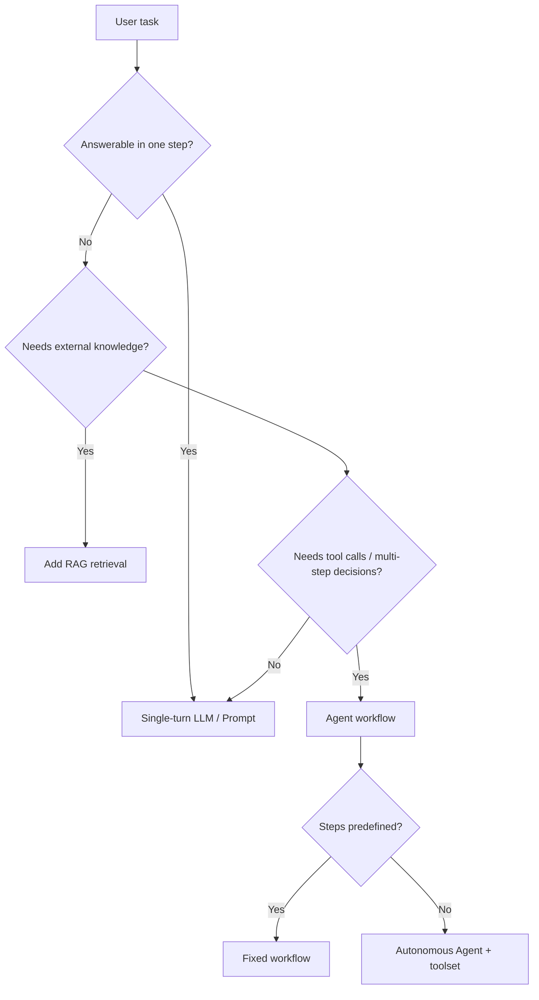
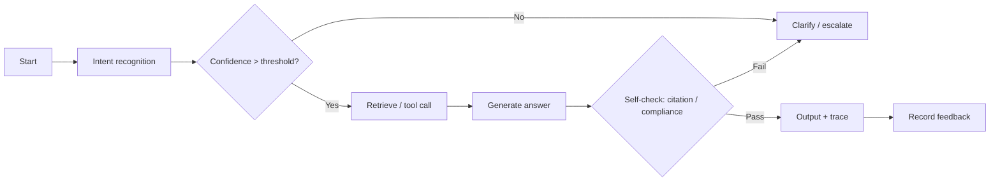

# 12 · Agent Workflow Template

> Used to describe the complete flow of an AI Agent / multi-step AI feature. The PM uses it to align with algorithm and engineering on "exactly how the AI walks each step."

## I. When Do You Need an Agent (Decide First)

Not every AI feature needs to be an Agent. Reference decision:

> Rule of thumb (from agent-orchestration and ai-agent-camp): **prefer a fixed workflow over an autonomous Agent**. The more autonomy, the higher the uncertainty, cost, and debugging difficulty.

## II. Agent Workflow Description Template

### 1. Goal & Boundary
- Agent name:
- Single responsibility (one sentence):
- Can do / Cannot do (explicit boundary):
- Trigger: user-initiated / event-driven / scheduled

### 2. Role & System Prompt (Key Points)
- Identity setting:
- Behavior rules / tone:
- Hard constraints (things it must never do):
- Refusal & escalation conditions:

### 3. Tool List (Tools)
| Tool name | Purpose | Input | Output | Failure handling |
|---|---|---|---|---|
| search_kb | retrieve knowledge base | query | document passage | empty result → clarifying question |
| create_ticket | create ticket | structured fields | ticket id | validation failed → refill |
| escalate_human | escalate to human | context | session handoff | — |

### 4. Step-by-Step Flow

### 5. State & Memory
- Session memory: how many turns to keep / summarization strategy
- Long-term memory: whether to write user persona / preferences
- Context budget: max Token per call, how to trim when exceeded

### 6. Uncertainty & Fault Tolerance (Red Line)
- Fallback per step: timeout, empty result, format error, tool error
- Confidence threshold: behavior below threshold (clarify / refuse / escalate)
- Human-in-the-loop points: marked on the flowchart (which step requires human review)
- Loop / deadlock protection: max steps, timeout circuit-breaker

### 7. Evaluation Hooks
- Instrument per step: intent hit, tool-call success rate, final task success rate
- Linked eval set (see 13): which cases for regression

### 8. Collaboration Handoff
- Product owns: flow definition, boundary, acceptance
- Algorithm owns: intent model, Prompt tuning, evaluation
- Engineering owns: tool implementation, orchestration engine, monitoring

---

## III. Example: AI Customer-Service Agent (Filled Sample)

- **Goal**: answer common post-sales questions; smoothly escalate to a human when unresolved.
- **Boundary**: does not approve refunds (only creates tickets), does not promise compensation amounts.
- **Tools**: search_kb (knowledge-base retrieval), query_order (order lookup), create_ticket (ticket creation), escalate_human (escalation).
- **Key fault tolerance**: intent confidence < 0.7 → clarifying question; 2 consecutive unresolved → auto-escalate; mentions amount / complaint keywords → escalate directly.
- **Human-in-the-loop points**: escalation node, info confirmation before ticket creation.
- **Evaluation**: task success rate, escalation rate, average handling turns, user satisfaction (post-session rating).

> More complete cases in 14-Five Product Cases.md.
