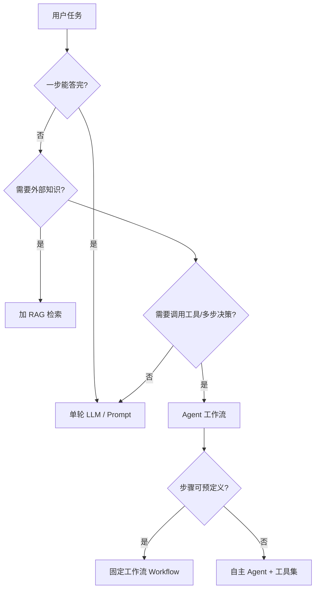
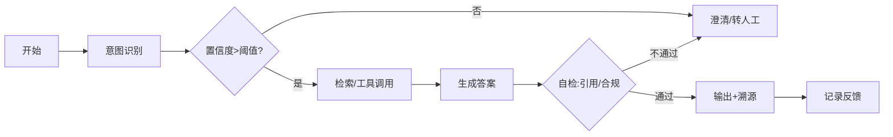

# 12 · Agent 工作流模板

> 用于描述一个 AI Agent / 多步 AI 功能的完整流程。产品经理用它与算法、工程对齐"AI 到底怎么走每一步"。

## 一、什么时候需要 Agent（判断先行）

不是所有 AI 功能都要做 Agent。参考决策：

> 经验法则（源自 agent-orchestration 与 ai-agent-camp）：**能用固定工作流就不要用自主 Agent**。自主性越高，不确定性、成本、调试难度越高。

## 二、Agent 工作流描述模板

### 1. 目标与边界
- Agent 名称：
- 单一职责（一句话）：
- 能做 / 不能做（明确边界）：
- 触发方式：用户主动 / 事件驱动 / 定时

### 2. 角色与系统提示（System Prompt 要点）
- 身份设定：
- 行为准则 / 语气：
- 硬性约束（绝不能做的事）：
- 拒答与转人工条件：

### 3. 工具清单（Tools）
| 工具名 | 用途 | 输入 | 输出 | 失败处理 |
|---|---|---|---|---|
| search_kb | 检索知识库 | query | 文档片段 | 空结果→澄清提问 |
| create_ticket | 建工单 | 结构化字段 | 工单号 | 校验失败→回填 |
| escalate_human | 转人工 | 上下文 | 会话转接 | — |

### 4. 流程步骤（Step-by-step）

### 5. 状态与记忆
- 会话记忆：保留多少轮 / 摘要策略
- 长期记忆：是否写入用户画像 / 偏好
- 上下文预算：单次最大 Token，超限如何裁剪

### 6. 不确定性与容错（红线）
- 每步的失败兜底：超时、空结果、格式错误、工具报错
- 置信度阈值：低于阈值的行为（澄清 / 拒答 / 转人工）
- 人工介入点：标注在流程图上（哪一步必须人审）
- 循环 / 死锁保护：最大步数、超时熔断

### 7. 评估钩子
- 每步埋点：意图命中、工具调用成功率、最终任务成功率
- 关联评估集（见 13）：用哪些 case 回归

### 8. 协作交接
- 产品负责：流程定义、边界、验收
- 算法负责：意图模型、Prompt 调优、评测
- 工程负责：工具实现、编排引擎、监控

---

## 三、示例：AI 客服 Agent（填好的样例）

- **目标**：解答售后常见问题，无法解决时平滑转人工。
- **边界**：不做退款审批（仅建单），不承诺赔付金额。
- **工具**：search_kb（知识库检索）、query_order（查订单）、create_ticket（建工单）、escalate_human（转人工）。
- **关键容错**：意图置信度 < 0.7 → 澄清提问；连续 2 次未解决 → 自动转人工；涉及金额/投诉关键词 → 直接转人工。
- **人工介入点**：转人工节点、工单创建前的信息确认。
- **评估**：任务成功率、转人工率、平均处理轮次、用户满意度（会话后评分）。

> 更多完整案例见 14-五个产品案例.md。
